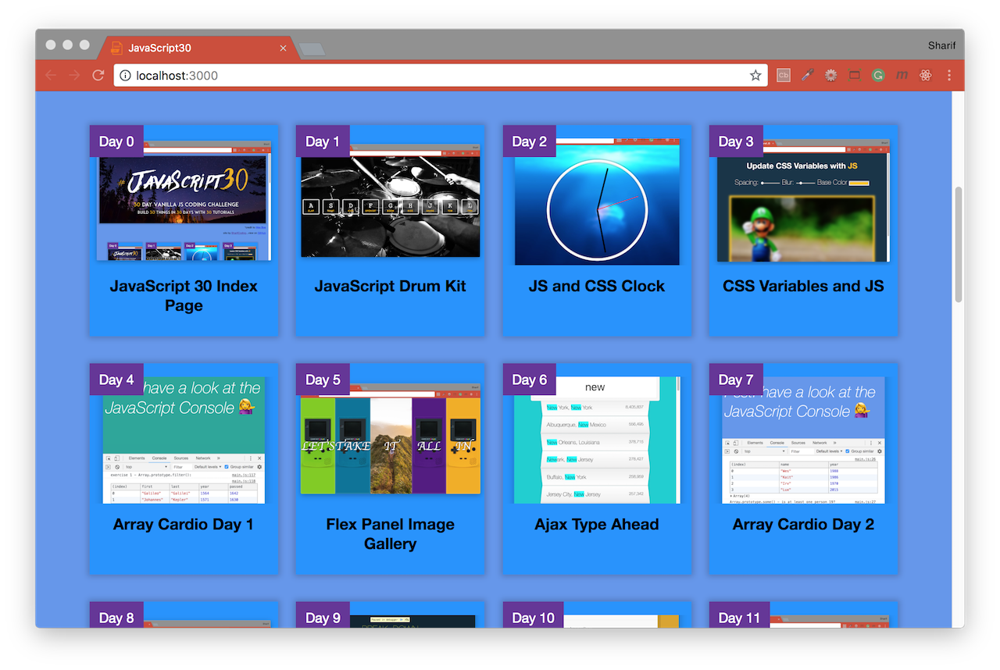

# [JavaScript 30 Day Challenge](https://javascript30.com/)

*credit to [Wes](https://wesbos.com/)

<b>No Frameworks :zap: No Compilers :zap: No Libraries :zap: No Boilerplate</b>

Build 30 JavaScript app in 30 days with vanilla JavaScript; no frameworks, libraries, etc. Pacing is totally up to the individual. The idea behind these exercises is to utilize small amounts of what would regularly be `downtime` as moments in which we can build on our knowledge through some simple exercises.

- [Day 0 - JavaScript 30 Index Page]() - HTML and CSS website showing 30 days of JavaScript challenges.
- [Day 1 - JavaScript Drum Kit](./day_01_to_10/day_01/README.md) - Enables users to play drum sounds using 9 buttons on their keyboard.
- [Day 2 - JS and CSS Clock](./day_01_to_10/day_02/README.md) - Displays an analog clock over an elegant background.
- [Day 3 - CSS Variables](./day_01_to_10/day_03/README.md) - Enables users to edit a photo through CSS variables and filters.
- [Day 4 - Array Cardio Day 1](./day_01_to_10/day_04/README.md) - Perform basic operations on JavaScript Arrays.
- [Day 5 - Flex Panel Gallery](./day_01_to_10/day_05/README.md) - Display images in a dynamic gallery using flexbox.
- [Day 6 - Ajax Type Ahead](./day_01_to_10/day_06/README.md) - Filter through a JSON based on what is being typed.
- [Day 7 - Array Cardio Day 2](./day_01_to_10/day_07/README.md) - Perform more operations on JavaScript Arrays.

- [Day 8 - Fun with HTML5 Canvas](./day_01_to_10/day_08/README.md) - Have dynamic fun in a HTML5 Canvas.
- [Day 9 - Must Know Dev Tools Tricks](./day_01_to_10/day_09/README.md) - Perform some nifty tricks using the dev tools.
- [Day 10 - Check Multiple Checkboxes](./day_01_to_10/day_10/README.md) - Select multiple checkboxes in succession by pressing the Shift key.
- [Day 11 - Custom HTML5 Video Player](./day_11_to_20/day_11/README.md) - Customize the HTML5 Video Player with more advanced features.
- [Day 12 - Key Sequence Detection](./day_11_to_20/day_12/README.md) - Detect a sequence of keys, like the Konami Code, using JS.
- [Day 13 - Slide in on Scroll](./day_11_to_20/day_13/README.md) - Slide in images in a website when the user scrolls to their location.
- [Day 14 - Object and Arrays - Reference VS Copy](./day_11_to_20/day_14/README.md) - Difference between references and copies in JavaScript.
- [Day 15 - LocalStorage and Event Delegation](./day_11_to_20/day_15/README.md) - Use local storage to persist a list.

- [Day 16 - CSS Text Shadow Mouse Move Effect](./day_11_to_20/day_16/README.md) - Changing orientation of a shadow depending on the mouse movement.
- [Day 17 - Sorting Band Names without articles](./day_11_to_20/day_17/README.md) - Sort an array alphabetically and ignore any articles.
- [Day 18 - Tally String times with Reduce](./day_11_to_20/day_18/README.md) - Add up timestamps with reduce.
- [Day 19 - Unreal Webcam Fun](./day_11_to_20/day_19/README.md) - Capture the feed from a webcam and manipulate it in different ways.
- [Day 20 - Native Speech Recognition](./day_11_to_20/day_20/README.md) - Recognize speech and display the text in a page.
- [Day 21 - Geolocation based Speedometer and Compass](./day_21_to_30/day_21/README.md) - Get the speed and direction of a user and display them with a compass.
- [Day 22 - Follow Along Link Highlighting](./day_21_to_30/day_22/README.md) - Highlight links when hovered upon dynamically.
- [Day 23 - Speech Synthesis](./day_21_to_30/day_23/README.md) - Synthesize speech and utter text written by the user.

---

- [Day 24 - Sticky Nav](./day_21_to_30/day_24/README.md) - Fix the nav bar once users have scrolled past its initial location.
- [Day 25 - Event Capture, Propagation, Bubbling and Once](./day_21_to_30/day_25/README.md) - Learn some rules about JavaScript's capture and bubbling.
- [Day 26 - Stripe Follow Along Dropdown](./day_21_to_30/day_26/README.md) - Get a dropdown to follow cursor through a nav bar.
- [Day 27 - Click and Drag to Scroll](./day_21_to_30/day_27/README.md) - Click and drag through a carousel of items.
- [Day 28 - Video Speed Controller UI](./day_21_to_30/day_28/README.md) - Control the speed of a video using a dedicated bar.
- [Day 29 - Countdown Clock](./day_21_to_30/day_29/README.md) - Display a countdown timer and enable quick breaks.

[Return to top](#javascript-30-day-challenge)
