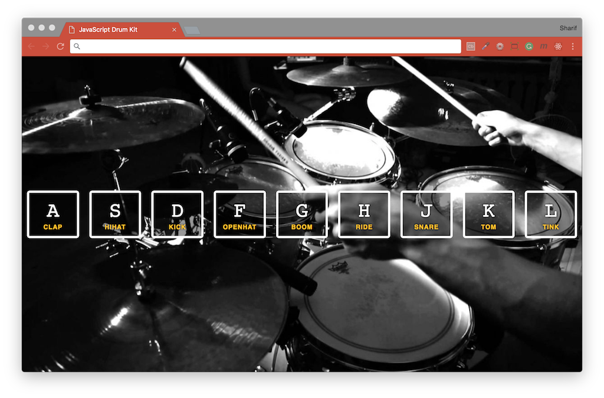

# [JavaScript 30 Day Challenge](https://javascript30.com/)


### Day 1 - JavaScript Drum Kit
A simple website enables users to play drum sounds using 9 buttons on their keyboard.

- What `<kbd>` does: The HTML Keyboard Input Element `<kbd>` represents user input and produces an inline element displayed in the browser's default monospace font.

- HTML `data-*` attributes: Introduced in HTML5, `data-*` attributes (where * can be anything you want) allow us to store _custom data_ on any HTML element. Each `div.key` (`<div class="key" data-key="...">`) and `audio` element in the provided HTML file has a `data-key` attribute which corresponds with a keyboard button.

- CSS `playing` class: The CSS file has a `playing` class defined with some rules in it. This class is applied to the correct element, depending on the key pressed by the user, and removed once animation is finished.

The `data-key` attributes is used to match up the correct audio clip with the `div` element, and we can use the `playing` class to add highlight border.

#### addEventListener
An _event listener_ added to the window object that is listening for a `keydown` event.
- `keydown` is the event name
- `playSound` is the function that runs when the event happens
```js
window.addEventListener('keydown', playSound);
```

#### querySelector & querySelectorAll
This will return the HTML element you trying to select (or all of them as a NodeList*).
```js
// use document.querySelector to listen for an audio by selecting an audio element where it has a data-key
const audio = document.querySelector(`audio[data-key="${event.keyCode}"]`);
// listen for each key stroke by selecting div element where it has a data-key
const key = document.querySelector(`div[data-key="${event.keyCode}"]`);
// stop the function running all together if data-key not found
if (!audio) return;
```

#### classList
If key is pressed repeatably, it needs to rewind to the beginning, `audio.currentTime=0` is added, `0` stands for seconds.
```js
key.classList.add('playing');
audio.currentTime = 0;
audio.play();
```

#### transitionend
You can listen for when a transition finishes, the length of the transition (in this case) was given by the following CSS `transition: all .07s ease;`
```js
key.addEventListener('transitionend', removeTransition)
```

#### Further Reading
- [http://keycode.info/](http://keycode.info/) - keyCode of each keyboard key.
- [addEventListener( )](https://developer.mozilla.org/en-US/docs/Web/API/EventTarget/addEventListener) - Called whenever the specified event is delivered to the target.
- [querySelector( )](https://developer.mozilla.org/en-US/docs/Web/API/Document/querySelector) - Returns the first Element within the document that matches the specified selector.
- [classList.add( )](https://developer.mozilla.org/en-US/docs/Web/API/Element/classList#Methods) - Add specified class values.
- [Using CSS transitions](https://developer.mozilla.org/en-US/docs/Web/CSS/CSS_Transitions/Using_CSS_transitions) - Control animation speed when changing CSS properties.
- [Array.from](https://developer.mozilla.org/en-US/docs/Web/JavaScript/Reference/Global_Objects/Array/from) - Creates a new, shallow-copied Array instance from an array-like or iterable object.

[Return to top](#javascript-30-day-challenge)

[Return to 30 Day Challenge](../../README.md)
