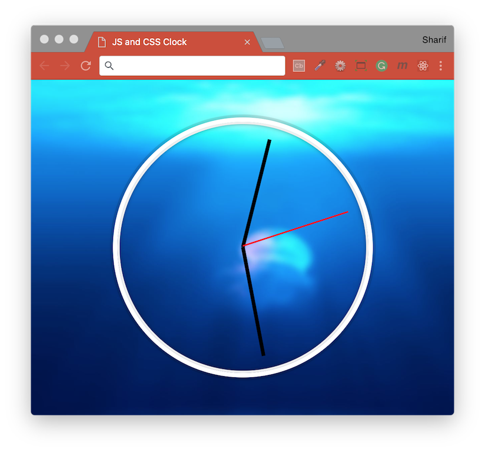

# [JavaScript 30 Day Challenge](https://javascript30.com/)


### Day 2 - JS and CSS Clock
A simple website displays an analog clock over an elegant background.

The HTML file has 3 `div` elements which correspond with the second, minute, and hour hand on a clock.
```html
<div class="hand hour-hand"></div>
<div class="hand min-hand"></div>
<div class="hand second-hand"></div>
```
We'll create references to these elements and dynamically update certain CSS properties to change their positions so they reflect the current time.

#### Date object
You can extract the second, minute and hour of the date object by accessing it's object methods.
```js
const now = new Date();

const seconds = now.getSeconds();
const minutes = now.getMinutes();
const hours = now.getHours();
```

#### setInterval
This can be used to perform a function at a given interval, 1000 is equal to 1 second.
- `setData` - method to run
- `1000` - interval to wait until running the method again
```js
setInterval(setDate, 1000);
```

#### style
You can use dot notation to add styles to an element extracted from the DOM. The transform attribute (on the HTML element with the class `second-hand`) has been given a dynamic value.
```js
const secondHand = document.querySelector('.second-hand');
secondHand.style.transform = `rotate(${secondsDegrees}deg)`;
```

#### transform-origin
This CSS attribute can be used to determine where a given transform 'pivots' from.
- `100%` - Moves the pivot from its default position (center i.e `50%`) to the end of the `x-axis`
```css
transform-origin: 100%;
```

#### transition-timing-function
Useful for adding a custom transition effect.
```css
transition-timing-function: cubic-bezier(0, 2.11, 0.58, 1);
```

#### Full JavaScript Code
```js
// element extracted from the DOM
const secondHand = document.querySelector('.second-hand');
const minuteHand = document.querySelector('.minute-hand');
const hourHand = document.querySelector('.hour-hand');

function setDate() {
  // create new Date object
  const now = new Date();

  // get current seconds and calculate the degree shift
  const seconds = now.getSeconds();
  const secondsDegrees = ((seconds / 60) * 360) + 90;
  // apply rotation to the clock hands corresponding with current time value
  secondHand.style.transform = `rotate(${secondsDegrees}deg)`;

  // get current minutes and calculate the degree shift
  const minute = now.getMinutes();
  const minuteDegrees = ((minute / 60) * 360) + ((seconds/60)*6) + 90;
  minuteHand.style.transform = `rotate(${minuteDegrees}deg)`;
  
  // get current hours and calculate the degree shift
  const hour = now.getHours();
  const hourDegrees = ((hour / 12) * 360) + ((minute/60)*30) + 90;
  hourHand.style.transform = `rotate(${hourDegrees}deg)`;
}
// call function once every second (1000ms === 1s)
setInterval(setDate, 1000);
setDate();
```

#### Further Reading
- [JavaScript Date](https://developer.mozilla.org/en-US/docs/Web/JavaScript/Reference/Global_Objects/Date) - Creates a JavaScript Date instance that represents a single moment in time.
- [setInterval( )](https://developer.mozilla.org/en-US/docs/Web/API/WindowOrWorkerGlobalScope/setInterval) - Repeatedly calls a function or executes a code snippet, with a fixed time delay between each call.
- [transform-origin](https://developer.mozilla.org/en-US/docs/Web/CSS/transform-origin) - The transform-origin CSS property sets the origin for an element's transformations.
- [transition-timing-function](https://developer.mozilla.org/en-US/docs/Web/CSS/transition-timing-function) - Used to describe how the intermediate values of the CSS properties being affected by a transition effect are calculated.

[Return to top](#javascript-30-day-challenge)

[Return to 30 Day Challenge](../../README.md)
