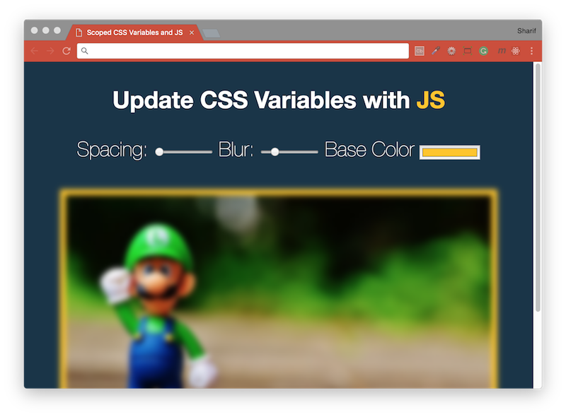

# [JavaScript 30 Day Challenge](https://javascript30.com/)


### Day 3 - CSS Variables
A website enables users to edit a photo through CSS variables and filters. This web page displays an image, and has 3 form inputs from which the user can manipulate the padding, blur amount, and background color of the image.

The purpose of this challenge is to gain experience using _CSS3 variables_. These are different from Sass-style variables;
- Sass variables are defined in the Sass file, but once compiled to CSS the values cannot be updated.
- CSS3 variables can have their values updated through the use of JavaScript.

The `input` _HTML elements_ have a `name` property that corresponds with the CSS properties. We can create _CSS3 variable references_ and attach them to the root element, provide them with some default values, and utilize JavaScript to attach _event listeners_ to the `input` _HTML elements_ that will call upon an _event handler_ function whenever the input values have been changed by the user. We will define the function to target the _entire document_ and update the values of the CSS variables from there.

#### variables
Like SASS, you can create variables for use throughout your stylsheet. The prefix `--` is necessary.
```scss
/* Definition - two hyphens (--) followed by the variable name */
--base: #ffc600;

/* Use - 'var(--variableName)' to use previously defined CSS properties */
img {
  padding: var(--spacing);
  background: var(--base);
  filter: blur(var(--blur));
}
.hl {
  color: var(--base);
}
```

#### addEventListener
Declared & defined a variable as a reference to all of the inputs on the page. The _HTML Node Elements_ is referencing and attach _event listeners_ to each one that will call on an _event handler_ whenever the input value has been changed (the `change` event). Additionally, listening for mouse movements on the inputs instead of value changes (the `mousemove` event).
```js
inputs.forEach(input => input.addEventListener('change', handleUpdate));
inputs.forEach(input => input.addEventListener('mousemove', handleUpdate));
```
#### dataset
Can be used to access data attribute values given to HTML elements. These data elements must be prefixed with `data-*`. An example is the following...
```html
<input id="spacing" type="range" name="spacing" min="10" max="200" value="10" data-sizing="px">
```
Accessing this value is done with the following code...
```js
const suffix = this.dataset.sizing;
```

#### Further Reading
- [CSS variables](https://developer.mozilla.org/en-US/docs/Web/CSS/Using_CSS_variables) - Using CSS custom properties (variables).
- [:root](https://developer.mozilla.org/en-US/docs/Web/CSS/:root) - The root element of a tree representing the document. 
- [CSS Tricks](https://css-tricks.com/almanac/properties/f/filter/) - Achieve varying visual effects.
- [“for” attribute](https://stackoverflow.com/questions/18432376/what-does-for-attribute-do-in-html-label-tag) - What does “for” attribute do in HTML <label> tag?
- [HTMLElement.dataset](https://developer.mozilla.org/en-US/docs/Web/API/HTMLElement/dataset) - Access to custom data attributes (data-*) set on the element.

[Return to top](#javascript-30-day-challenge)

[Return to 30 Day Challenge](../../README.md)
