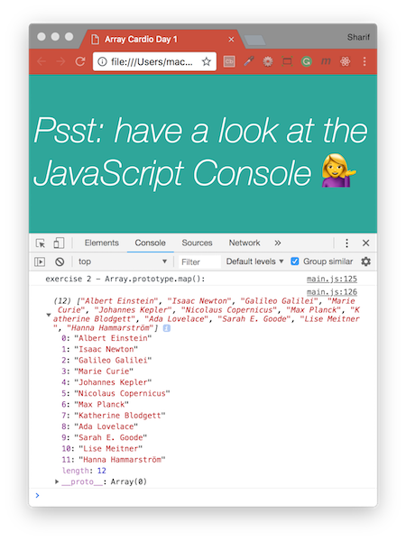
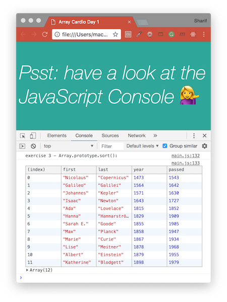
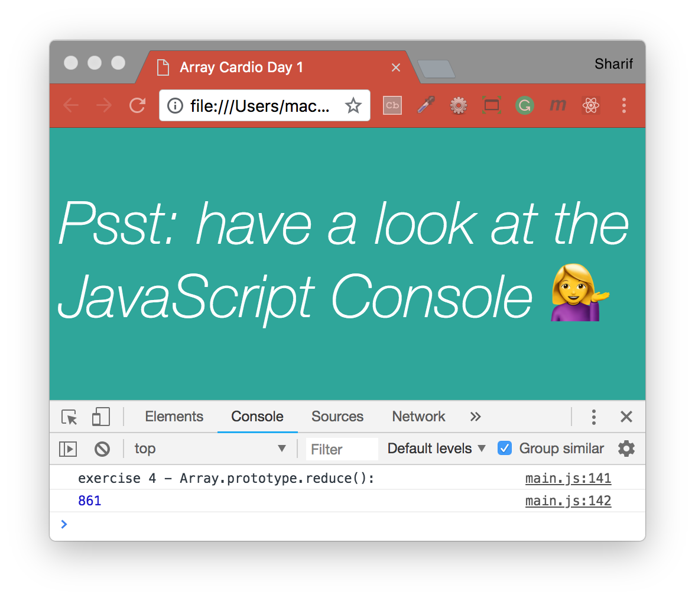
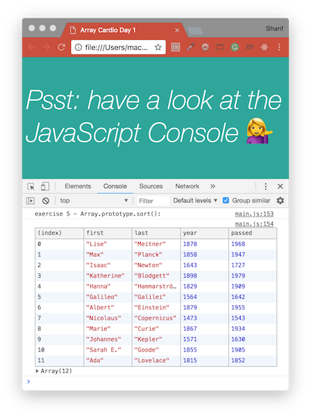
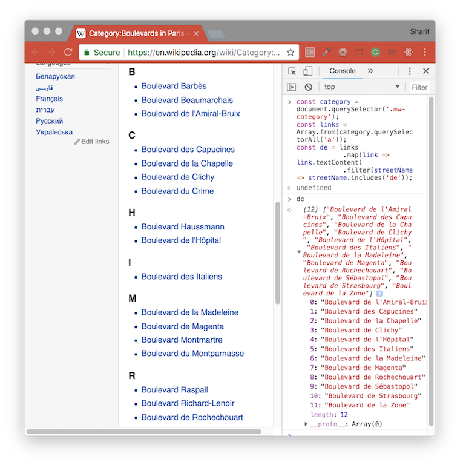
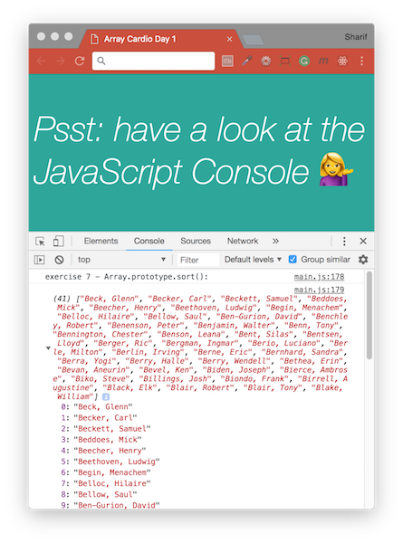
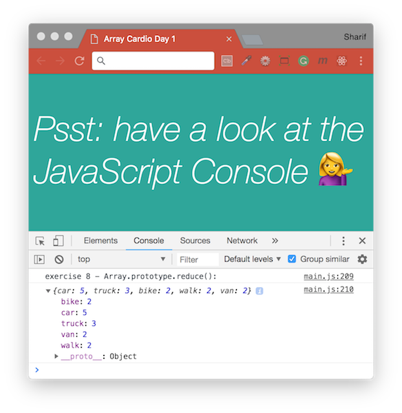

# [JavaScript 30 Day Challenge](https://javascript30.com/)

### Day 4 - Array Cardio Day 1
Perform basic operations on JavaScript Arrays. Use built-in array methods (filter, map, sort, reduce, split, reduce, and ES6 syntax) and perform the necessary operations to provide the expected values.

#### Array.filter
This can be used to assess each item of an array against a condition. If the resulting boolean expression returns `true` it will 'pass the condition' and be returned in the filtered array.
`inventor` takes the role of the current iterand, much like `i` in a traditional `for (var i = 0; i++; i < arr.length)` loop
```js
const fifteen = inventors.filter(inventor => (inventor.year >= 1500 && inventor.year < 1600));
```

#### Array.from
Reminder: `querySelectorAll` does not return an Array but returns a NodeList.
Array.from(some_nodeList); converts a NodeList into Array.
This is useful when you wish to apply array methods to a node list extracted from a website (in this case wikipedia).
Now, you are able to apply, `map`, `reduce`, `sort` etc... to links.
```js
const links = Array.from(category.querySelectorAll('a'));
```

#### Array.reduce
This method takes an array and attempts to wittle it down to a result you require. It's best to think of the parameters as an `accumulator` and `iterand` in this case. The `0` provides a starting point for the total, since at the start it would be `undefined`.
```js
const totalYears = inventors.reduce((total, inventor) => {
    return total + (inventor.passed - inventor.year);
}, 0)
```

#### 1. Filter the list of inventors for those who were born in the 1500's
```js
// original code
const fifteen = inventors.filter(function(inventor) { 
  if(inventor.year >= 1500 && inventor.year < 1600) {
    return true;
  }
});
// refactored code
const fifteen = inventors.filter(inventor => (inventor.year >= 1500 && inventor.year < 1600));
```


#### 2. Give us an array of the inventors first and last names
```js
// original code
const fullNames = inventors.map(function(inventor) {
  return (inventor.first + ' ' + inventor.last);
  });

// refactored code
const fullNames = inventors.map(inventor => `${inventor.first} ${inventor.last}`);
```


#### 3. Sort the inventors by birthdate (oldest to youngest)
```js
// original code
const ordered = inventors.sort(function(a, b) {
  if(a.year > b.year) {
    return 1;
  } else {
    return -1;
  }
});

// refactored code
const ordered = inventors.sort((a, b) => a.year > b.year ? 1 : -1);
```


#### 4. How many years did all the inventors live?
```js
// original code
const totalYears = 0;
for (var i = 0; i < inventors.length; i++) {
    totalYears += inventors[i].year
}

// refactored code
const totalYears = inventors.reduce((total, inventor) => {
    return total + (inventor.passed - inventor.year);
}, 0)
```


#### 5. Sort the inventors by years lived
```js
// original code
const oldest = inventors.sort((a, b) => {
  const lastGuy = a.passed - a.year;
  const nextGuy = b.passed - b.year;
  if(lastGuy > nextGuy) {
    return -1;
  } else {
    return 1;
  }
});

// refactored code
const oldest = inventors.sort((a, b) => {
  const lastGuy = a.passed - a.year;
  const nextGuy = b.passed - b.year;
  return lastGuy > nextGuy ? -1 : 1;
});
```


#### 6. Create a list of [Boulevards in Paris](https://en.wikipedia.org/wiki/Category:Boulevards_in_Paris) that contain `'de'` anywhere in the name
```js
// original code
const category = document.querySelector('.mw-category');
const links = Array.from(category.querySelectorAll('a'));
const de = links
    .map(link => link.textContent)
    .filter(streetName => streetName.includes('de'));

// ES6 spread
const category = document.querySelector('.mw-category');
const links = [...category.querySelectorAll('a')];
const de = links
    .map(link => link.textContent)
    .filter(streetName => streetName.includes('de'));
```


#### 7. Sort the people alphabetically by last name
```js
// original code
const alpha = people.sort(function(lastOne, nextOne) {
  const [aLast, aFirst] = lastOne.split(', ');
  const [bLast, bFirst] = nextOne.split(', ');
  if(aLast > bLast) {
    return 1;
  } else {
    return -1;
  }
});

// refactored code
const alpha = people.sort((lastOne, nextOne) => {
    const [aLast, aFirst] = lastOne.split(', ');
    const [bLast, bFirst] = nextOne.split(', ');
    return aLast > bLast ? 1 : -1;
});
```


#### 8. Sum up the instances of each of transportation data
Perhaps a more complex use case for reduce is when trying to acheieve a result for multiple elements in an array. The goal was to reduce each element to its accumulated number. The key in this case, was to use an `empty object` as the initial value for the object, and call `obj[key]` for each iteration.
```js
const transportation = data.reduce((obj, item) => {
  if (!obj[item]) {
    obj[item] = 0;
  }

obj[item] ++;
return obj;
}, {});
```
In the code above, `obj` is an element passed to the reduce function which will gather data over each iteration. For each unique element in an array, an `obj` will be created. The name of the element goes into the index of the `obj`. So every time an element is found, the value of that item (the element from the data array) will increase by 1 in the `obj` object. To initialize the object as a blank object, we have added `{}` at the end.


#### Further Reading
- [Array.prototype.map( )](https://developer.mozilla.org/en-US/docs/Web/JavaScript/Reference/Global_Objects/Array/map) - Creates a new array with the results of calling a provided function on every element in the calling array.
- [Array.prototype.reduce( )](https://developer.mozilla.org/en-US/docs/Web/JavaScript/Reference/Global_Objects/Array/Reduce) - Applies a function against an accumulator and each element in the array (from left to right) to reduce it to a single value.
- [Array.prototype.sort( )](https://developer.mozilla.org/en-US/docs/Web/JavaScript/Reference/Global_Objects/Array/Sort) - Sorts the elements of an array in place and returns the array.
- [Array.prototype.filter( )](https://developer.mozilla.org/en-US/docs/Web/JavaScript/Reference/Global_Objects/Array/Filter) - Creates a new array with all elements that pass the test implemented by the provided function.
- [ES6 spread syntax](https://developer.mozilla.org/en-US/docs/Web/JavaScript/Reference/Operators/Spread_syntax) - Allows an iterable such as an array expression to be expanded in places where zero or more arguments or elements are expected.

[Return to top](#javascript-30-day-challenge)

[Return to 30 Day Challenge](../README.md)
