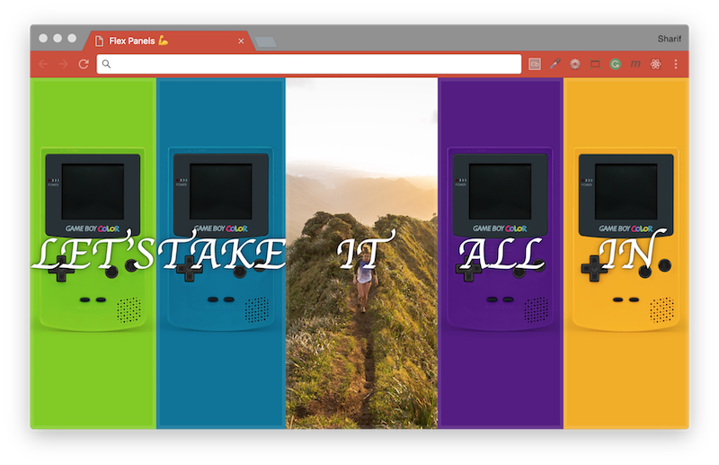

# [JavaScript 30 Day Challenge](https://javascript30.com/)


### Day 5 - Flex Panel Gallery
Display images in a dynamic gallery using flexbox.

This HTML page consist of five `div` HTML elements with a class `panels`, each containing three `p` HTML elements with some text, only one `p` element is active when panel is closed. These five `div` elements are wrapped inside another `div` element with a class `panel`. When clicking on a particular `div` element will expand that element and bring the two other `p` elements back into view.

Flex box layouts consist of a _flex container_ which contain _flex items_. The `panels` class is used as the _flex container_, and the `panel` class as the _flex items_. By default, _flex items_ are only as wide as they need to be in order to display their contents. The _flex items_ takes up equal space and fill out the _flex container_. Content of each _flex item_ to be flexible, going to display the `panel` class as both a _flex item_ and a _flex container_; this means that elements with the `panel` class will adjust themselves with respect to their _flex container_ (`div` HTML element with class `panels`), and the contents within those elements (in this case, the three `p` HTML elements) will adjust themselves with respect to their own _flex container_ (`div` HTML element with  class `panels`).

#### toggle
This will respond to an event via an event listener. This is commonly used in click events (which is what its used for in this case). `this` refers to each separate panel when clicked on.
```js
this.classList.toggle('open');
```
#### event.propertyName
When listening for `transitionend`, the event might return multiple results. Utilising `propertyName` you can respond to a transition of choice. `includes()` used here, since IE explorer refers to the flex property as `flex-grow`.
```js
event.propertyName.includes('flex');
```

#### JavaScript
JavaScript code to attach _event listeners_ to each `panel` element that will fire when an panel is clicked on and call their respective _event handlers_; one _event handler_ function will adjust the size of the panel, and the other will be responsible for bringing in the `p` elements that we pushed off earlier.
```js
// Variable as a reference to all elements with a class `panels`.
const panels = document.querySelectorAll('.panel');
// Function to toggle the class `open` on the function context.
function toggleOpen() {
  this.classList.toggle('open');
}
/* Function to toggle the class `open-active` on the function context,
event triggered with a property name that includes the word 'flex'. */
function toggleActive(event) {
  if (event.propertyName.includes('flex')) {
    this.classList.toggle('open-active');
  }
}
/* An event listeners for the `click` and `transitionend` event to each element,
and functions as the event handler. */
panels.forEach(panel => {
  panel.addEventListener('click', toggleOpen);
});
panels.forEach(panel => {
  panel.addEventListener('transitionend', toggleActive);
});
```

#### Further Reading
- [How to toggle class](https://www.w3schools.com/howto/howto_js_toggle_class.asp) - Toggle between adding and removing a class name from an element.
- [event.propertyName](https://www.w3schools.com/jsref/event_transition_propertyName.asp) - Returns the name of the CSS property associated with the transition.
- [What the Flexbox?!](http://flexbox.io) - Free 20 video course that will help you master CSS Flexbox!
- [css-tricks](https://css-tricks.com/snippets/css/a-guide-to-flexbox/) - A Complete Guide to Flexbox.

[Return to top](#javascript-30-day-challenge)

[Return to 30 Day Challenge](../../README.md)
