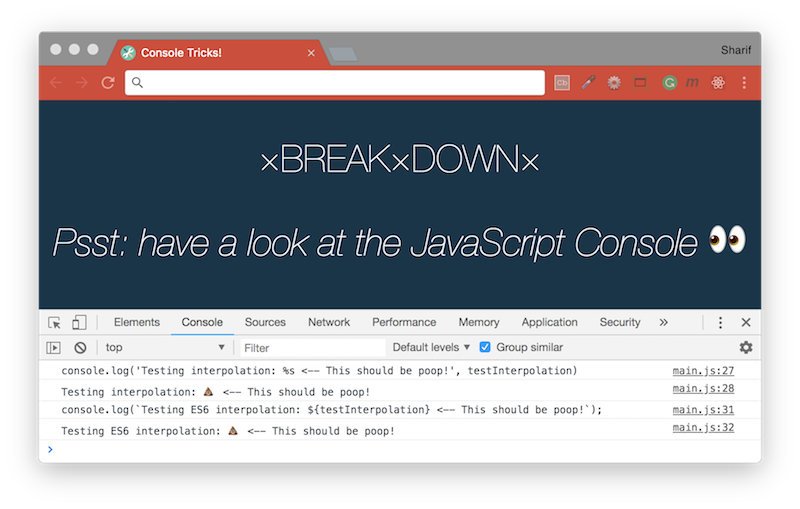
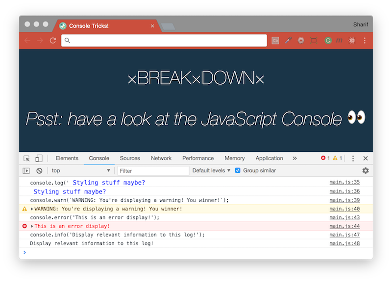
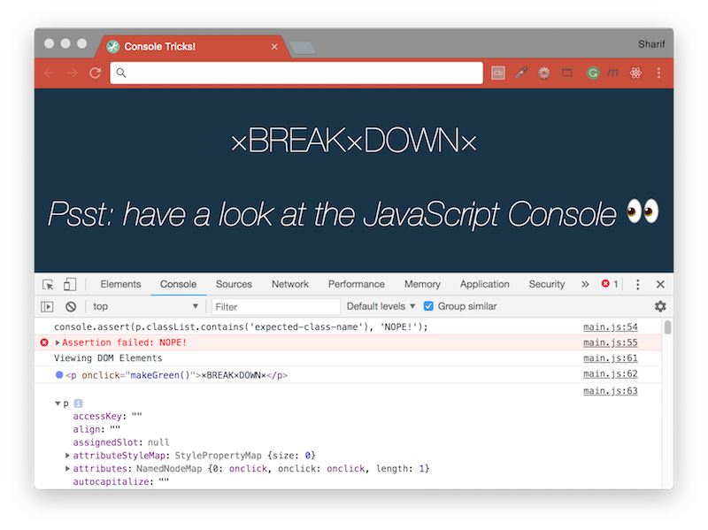
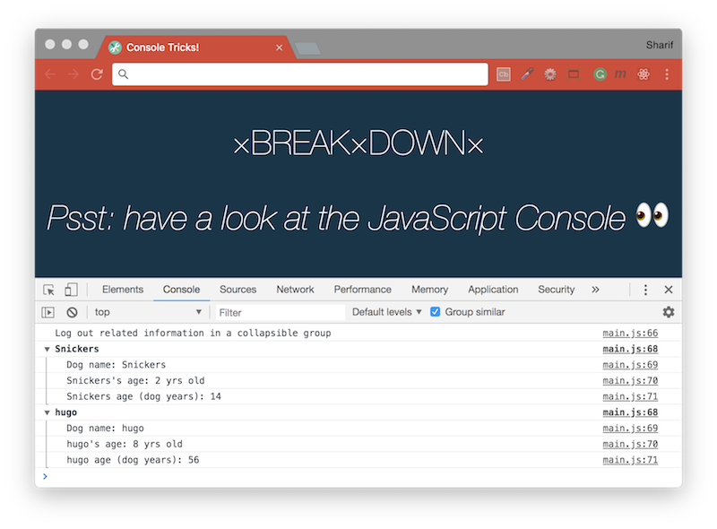
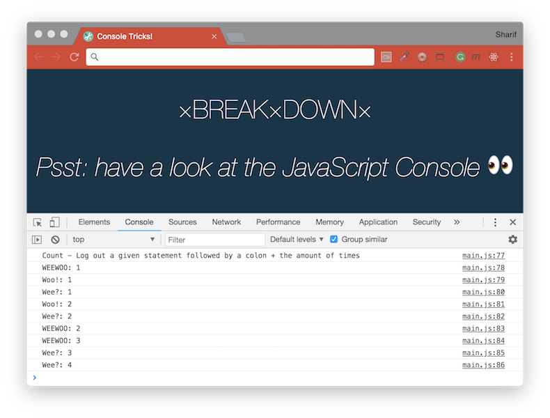
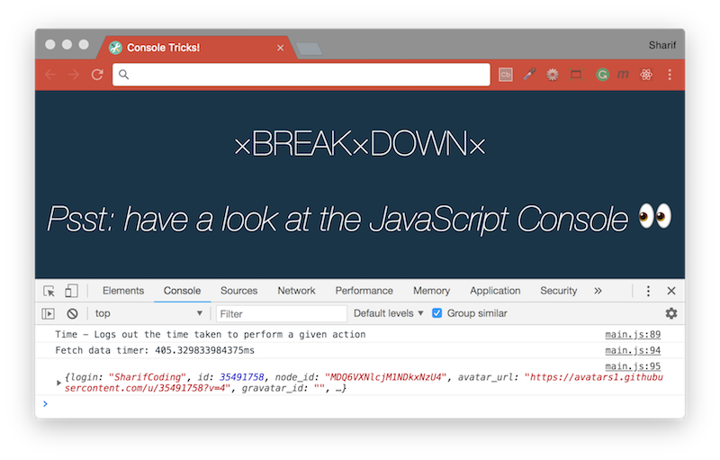
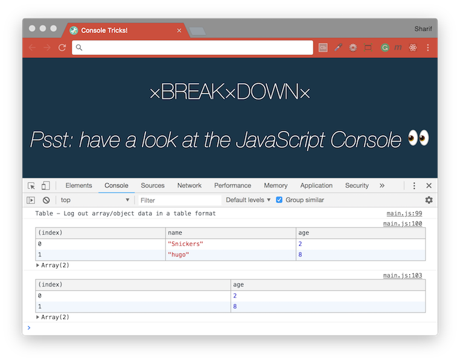

# [JavaScript 30 Day Challenge](https://javascript30.com/)

### Day 9 - Must Know Dev Tools Tricks
Perform some nifty tricks using the dev tools.

This is a simple dev tools exercise. Exploring how to set _break points_ in the browser debugger, and learn about various `console` methods that allow us to be more specific about the event being logged out (is it a warning, an error, a collection of data, etc).

#### Break point:
In Chrome dev tools, go to the 'elements' tab and right-click the 'p' HTML tag. Select 'break on > attribute modifications`. This places a break point in the console debugger if any attribute for the targeted element is changed. If we click on the 'p' tag (which will trigger the makeGreen() function), the colour attribute is changed, at which point the browser will PAUSE the program and highlight the line of code which triggered the break point.

To remove the break point, navigate back to the 'elements' tag, right click the 'p' tag, and uncheck the 'break on > attribute removal' option.
```js
function makeGreen() {
  const p = document.querySelector('p');
  p.style.color = '#BADA55';
  p.style.fontSize = '50px';
}
```


#### Interpolated:
Dynamically update the string value logged out using `%s`, with ES6 template string as well.
```js
let testInterpolation = '💩';
console.log('Testing interpolation: %s <-- This should be poop!', testInterpolation);
console.log(`Testing ES6 interpolation: ${testInterpolation} <-- This should be poop!`);
```


#### Various console display styles:
Styled; apply styling to a log event using `%c`. Warnings; displays a log event preceded with a caution sign. Error; displays a log event highlighted in red with an `'x'`. Info; displays a log event preceded by an `'i'`.
```js
console.log('%c Styling stuff maybe?', 'font-size:1.2em; color: blue;');

console.warn(`WARNING: You're displaying a warning! You winner!`);

console.error('This is an error display!');

console.info('Display relevant information to this log!');
```


#### Testing:
You can use use assertions in the console, a very basic assert statement which accepts two arguments; the expression we want to evaluate the truthiness of, and a message to display if the assertion fails.
```js
const p = document.querySelector('p');
console.assert(p.classList.contains('expected-class-name'), 'NOPE!');
```

#### Viewing DOM Elements
If you wish to see an elements properties and methods in a cleaner form; standard console log event `console.dir(p)`, and logs out an interactive list of properties for a given object `console.dir(p)`.
```js
console.log(p);
console.dir(p);
```


#### Groupings:
Log out related information in a collapsible group. One useful feature for neatening the output on the console is `groupCollapsed` Using this along with `groupEnd` ensures that the data for each list item will be concise and separate.
```js
const dogs = [{ name: 'Snickers', age: 2 }, { name: 'hugo', age: 8 }];
dogs.forEach(dog => {
  console.groupCollapsed(`${dog.name}`);
  console.log(`Dog name: ${dog.name}`);
  console.log(`${dog.name}'s age: ${dog.age} yrs old`);
  console.log(`${dog.name} age (dog years): ${dog.age * 7}`);
  console.groupEnd(`${dog.name}`);
})
```


#### Count:
Log out a given statement followed by a colon + the amount of times this particular statement has already been logged.
```js
console.count('WEEWOO');
console.count('Woo!');
console.count('Wee?');
console.count('Woo!');
console.count('Wee?');
console.count('WEEWOO');
console.count('WEEWOO');
console.count('Wee?');
console.count('Wee?');
```


#### Time:
Logs out the time taken to perform a given action.
```js
console.time('Fetch data timer');
fetch('https://api.github.com/users/SharifCoding')
.then(data => data.json())
.then(data => {
  console.timeEnd('Fetch data timer');
  console.log(data);
});
```


### Table:
Log out array/object data in a table format. Provide properties to be displayed in the table as an array of string values corresponding with property names.
```js
console.table(dogs);
console.table(dogs, ["age"]);
```


#### Further Reading
- [Console Web APIs](https://developer.mozilla.org/en-US/docs/Web/API/console) - The Console object provides access to the browser's debugging console.
- [Using the Console](https://developers.google.com/web/tools/chrome-devtools/console/) - Learn how to: stack redundant messages or display them on their own lines, and clear or persist output or save it to a file, filter output.
- [Javascript Debugging](https://medium.com/appsflyer/10-tips-for-javascript-debugging-like-a-pro-with-console-7140027eb5f6) - 10 Tips for Javascript Debugging Like a PRO with Console.

[Return to top](#javascript-30-day-challenge)

[Return to 30 Day Challenge](../README.md)
