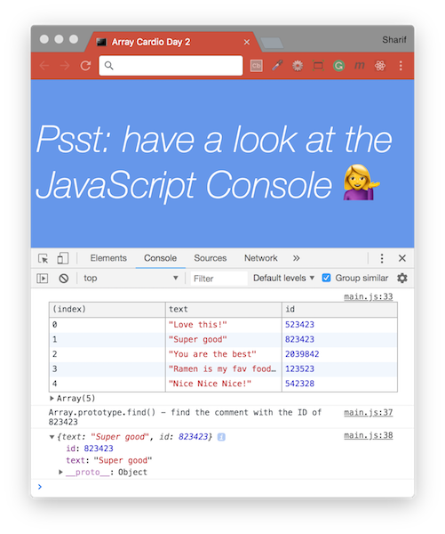
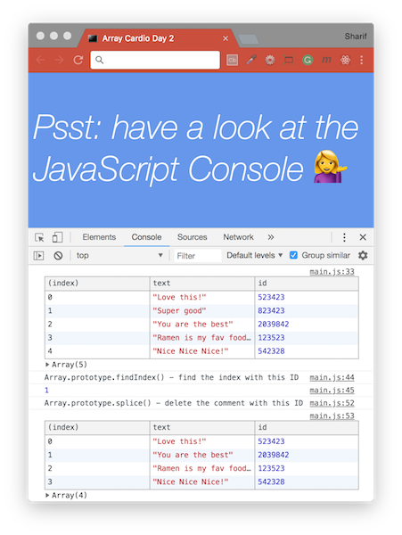

# [JavaScript 30 Day Challenge](https://javascript30.com/)

### Day 7 - Array Cardio Day 2
Perform more operations on JavaScript Arrays. Use built-in array methods (some, every, findIndex, and splice) and perform the necessary operations to provide the expected values.

#### Array.prototype.some( )
Checks against the array, and returns `true` if at least one item meets the condition.
- `new Date()).getFullYear()` gets the current year
```js
const isAdult = people.some(person => (new Date()).getFullYear() - person.year >= 19);
```

#### Array.prototype.every( )
Checks against the array, and returns `true` if all items meets the condition.
- `new Date()).getFullYear()` gets the current year
```js
const allAdults = people.every(person => (new Date()).getFullYear() - person.year >= 19);
```

#### Array.prototype.find( )
Checks against the array, and returns the result of the item that meets the criteria (in this case it is an object)
```js
const index = comments.find(comment => comment => comment.id === 823423);
```

#### Array.prototype.findIndex( )
Checks against the array, and returns `array id` of the item that meets the condition.
```js
const index = comments.findIndex(comment => comment.id === 823423);
```

#### 1. Some (at least one person 19) and Every (everyone 19) Checks
```js
// original code
const isAdult = people.some(function(person) {
  const currentYear = (new Date()).getFullYear();
  if(currentYear - person.year >= 19) {
    return true;
  }
});
// refactored code
const isAdult = people.some(person => ((new Date()).getFullYear()) - person.year >= 19);
const allAdults = people.every(person => ((new Date()).getFullYear()) - person.year >= 19);
```


#### 2. Find (find the comment with the ID of 823423) Checks
```js
// find is like filter but instead returns just the one you are looking for
// original code
const comment = comments.find(function(comment) {
  if(comment.id === 823423) {
    return true;
  }
});
// refactored code
const comment = comments.find(comment => comment.id === 823423);
```


#### 3. FindIndex (find index with ID of 823423) and Delete (delete the comment with this ID) Checks
```js
// original code
comments.splice(index, 1);
// redux alternative code with ES6 spread syntax
const newComments = [
  ...comments.slice(0, index),
  ...comments.slice(index + 1)
];
```


#### Further Reading
- [Array.prototype.some( )](https://developer.mozilla.org/en-US/docs/Web/JavaScript/Reference/Global_Objects/Array/some) - Tests whether at least one element in the array passes the test implemented by the provided function.
- [Array.prototype.every( )](https://developer.mozilla.org/en-US/docs/Web/JavaScript/Reference/Global_Objects/Array/every) - Tests whether all elements in the array pass the test implemented by the provided function.
- [Array.prototype.find( )](https://developer.mozilla.org/en-US/docs/Web/JavaScript/Reference/Global_Objects/Array/find) - Returns the value of the first element in the array that satisfies the provided testing function.
- [Array.prototype.findIndex( )](https://developer.mozilla.org/en-US/docs/Web/JavaScript/Reference/Global_Objects/Array/findIndex) - Returns the index of the first element in the array that satisfies the provided testing function.
- [Array.prototype.splice( )](https://developer.mozilla.org/en-US/docs/Web/JavaScript/Reference/Global_Objects/Array/splice) - Changes the contents of an array by removing existing elements and/or adding new elements.

[Return to top](#javascript-30-day-challenge)

[Return to 30 Day Challenge](../README.md)
