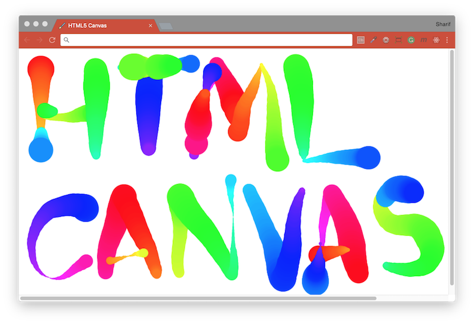

# [JavaScript 30 Day Challenge](https://javascript30.com/)


### Day 8 - Fun with HTML5 Canvas
Have dynamic fun in a HTML5 Canvas.

An HTML page with a `canvas` element in which the user will be able to click and drag their mouse to draw. When the user clicks+drags their mouse, they should see a line being drawn out on the canvas that starts from the original mouse location and ends where the user released the mouse click. This line should be multicolor, and should increase and decrease in width.

Defined an _anonymous function_ that will contain the rest of application logic, this creates a _closure_ which allows to safely execute the code without having to worry about polluting the global namespace (`window` object). Within the body of the anonymous function, declare variable references to the `canvas` HTML element and it's context, variables defined as objects storing the previous and current positions of the mouse, and two variables defined as a numerical and boolean value for the hue and line width, respectively. Two more functions will be used as _event handlers_; one which will draw on the `canvas`, and one which will update the variables referencing the current & previous mouse positions. Event handlers attached to the `canvas` element for the following events: `'mousemove'`, `'mouseup'`, `'mousedown'`, and `'mouseout'`.

##### getContext
The canvas has properties that can be modified affecting the line style.
```js
const ctx = canvas.getContext('2d');
ctx.strokeStyle = '#BADA55';
ctx.lineJoin = 'round';
ctx.lineCap = 'round';
ctx.lineWidth = 10;
```

#### Destructuring assignment
ES6 allows you to easily name multiple variables, via the following notation
```js
[lastX, lastY] = [event.offsetX, event.offsetY];
```

#### Variable declarations & definitions:
```js
// Declare & define a variable reference to `canvas` HTMLElement with `width` and `height` properties matching the available window size.
const myCanvas = document.querySelector('#draw');
myCanvas.width = window.innerWidth;
myCanvas.height = window.innerHeight;

// Declare & define a variable reference to the canvas `context`, and set the necessary property values so that lines end and connect smoothly.
const ctx = myCanvas.getContext('2d');
ctx.lineJoin = 'round';
ctx.lineCap = 'round';

// Declare two variables which will hold the current and previous mouse location coordinates, and define them both as objects containing `x` and `y` properties with a value of `0`.
const mouse = { x: 0, y: 0 }, last_mouse = { ...mouse};

// Declare two variables that will be responsible for maintaining the line hue (should be a number value between 0 and 360) and line width (a boolean set to `true`).
let hue = 0, increaseLineWidth = true;
```

#### Declare a function which will be responsible for drawing on the canvas:
```js
// Set the `strokeStyle` property of the canvas context to be an `hsl` color property.
ctx.strokeStyle = `hsl(${hue}, 100%, 50%)`;

// Begin/reset the current path and move the starting point of the path to the `x` and `y` properties of the object referencing the previous mouse location.
ctx.beginPath();
ctx.moveTo(last_mouse.x, last_mouse.y);

// Set the end point of the path as the `x` and `y` properties of the object referencing the current mouse location.
ctx.lineTo(mouse.x, mouse.y);

// Connect and create the path between the two points, and then draw it out.
ctx.closePath();
ctx.stroke();

// Increment the `hue` value until it reaches `360`, at which point reset it and start the process again.
hue >= 360 ? 0 : hue++;

// Increment the line width as long as the value stays between 1 & 100.
increaseLineWidth ? ctx.lineWidth++ : ctx.lineWidth--;
if (ctx.lineWidth >= 100 || ctx.lineWidth <= 1) increaseLineWidth = !increaseLineWidth;
```

#### Further Reading
- [HTML Canvas](https://www.w3schools.com/html/html5_canvas.asp) - The HTML `<canvas>` element is used to draw graphics on a web page.
- [HTML5 Canvas Tutorials](https://www.html5canvastutorials.com/) - Tutorials and resources to learn Canvas and other HTML5 aspects.
- [Get started with HTML canvas](https://www.creativebloq.com/how-to/get-started-with-html-canvas) - Explore the basics of canvas for simple visuals and animation.

[Return to top](#javascript-30-day-challenge)

[Return to 30 Day Challenge](../README.md)
