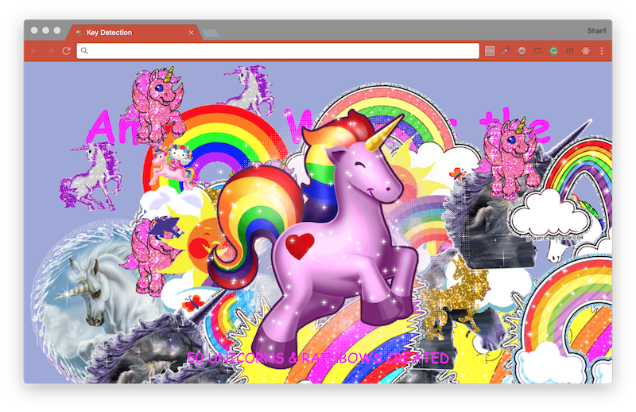

# [JavaScript 30 Day Challenge](https://javascript30.com/)


### Day 12 - Key Sequence Detection
Detect a sequence of keys, like the Konami Code, using JS.

An HTML document with...basically nothing. There's a `script` tag in the document header that loads a JavaScript file from [Cornify.com](https://www.cornify.com) which will inject an image of a unicorn (🦄🦄🦄!) into the DOM and a `p` element on the bottom of the page if we call `cornify_add()`. The goal of this challenge is to generate new unicorns every time the user succesfully enters a 'secret code' that we will decide on.

#### event.key
When listening for a keyup event, you can access the name of the key being pressed.
```js
event.key;
```
This will return, for example 'Shift' if this key was pressed

#### splicing an array for the last pressed 'word'
If you are trying to match user input, you may need the last pressed 'x' digits, a cool way of doing this is to add their input to an array and apply a `splice` followed by `join`.
```js
pressed.push(event.key)
pressed.splice(-secretCode.length - 1, pressed.length - secretCode.length);
```
The splice in this case:
- starts at the end of the array
- ends when the length of the `secretCode` has been met

#### Further Reading
- [KeyboardEvent.key](https://developer.mozilla.org/en-US/docs/Web/API/KeyboardEvent/key) - Returns the value of the key pressed.
- [String.prototype.includes( )](https://developer.mozilla.org/en-US/docs/Web/JavaScript/Reference/Global_Objects/String/includes) - Determines whether one string may be found within another string.
- [Array.prototype.push( )](https://developer.mozilla.org/en-US/docs/Web/JavaScript/Reference/Global_Objects/Array/push) - Adds one or more elements to the end of an array and returns the new length of the array.
- [Cornify](http://www.cornify.com/) - Cornify is the #1 unicorn and rainbow service worldwide, spreading sparkly happiness around the world.
- [Konami Code](http://contra.wikia.com/wiki/Konami_Code) - A special combination of buttons that appears in several Konami games.

[Return to top](#javascript-30-day-challenge)

[Return to 30 Day Challenge](../../README.md)
