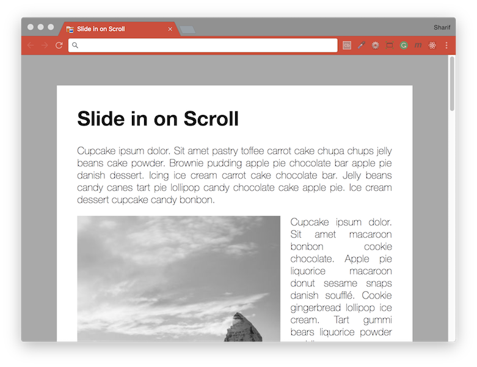

# [JavaScript 30 Day Challenge](https://javascript30.com/)


### Day 13 - Slide in on Scroll
Slide in images in a website when the user scrolls to their location.

An HTML document with multiple paragraphs and images, where the images slide into view when the user scrolls to a point where it would be logical to display the image.

When you want to manipulate the DOM on scroll, it's important to limit the number of events that need a response.
The debounce method will wait 20ms before registering an event, which will reduce browser overhead.

#### window object
The window (and other objects) have plenty of properties associated with scrolling activity that can be viewed and manipulated.
```js
window.scrollY
window.innerHeight
sliderImage.offsetTop
```
Properties above represent different values subject to scrolling behaviour.

#### check slide
```js
function checkSlide() {
  sliderImages.forEach(sliderImage => {
    // half way through the image
    // current scroll location in relation to the midway point of the image
    const slideInAt = (window.scrollY + window.innerHeight) - sliderImage.height / 2;
    // bottom of the image
    // bottom of the image in relation to the entire page
    const imageBottom = sliderImage.offsetTop + sliderImage.height;
    // boolean value to decide if user has scrolled past the midway point of an image
    const isHalfShown = slideInAt > sliderImage.offsetTop;
    // boolean value to decide if the user has scrolled the image out of view
    const isNotScrolledPast = window.scrollY < imageBottom;
    // if the user has scrolled to a point where they are past the midway point of an image
    // and the image is still in view, attach the 'active' class to the image, otherwise remove it
    if (isHalfShown && isNotScrolledPast) {
      sliderImage.classList.add('active');
    } else {
      sliderImage.classList.remove('active');
    }
  });
}
```

#### Further Reading
- [JavaScript Debounce Function](https://davidwalsh.name/javascript-debounce-function) - Debounce function limits the rate at which a function can fire.
- [transform CSS](https://developer.mozilla.org/en-US/docs/Web/CSS/transform) - This property lets you rotate, scale, skew, or translate a given element.
- [Window.scrollY](https://developer.mozilla.org/en-US/docs/Web/API/Window/scrollY) - Returns the number of pixels that the document is currently scrolled vertically.
- [Window.innerHeight](https://developer.mozilla.org/en-US/docs/Web/API/Window/innerHeight) - Height of the browser window viewport.
- [HTMLElement.offsetTop](https://developer.mozilla.org/en-US/docs/Web/API/HTMLElement/offsetTop) - Returns the distance of the current element relative to the top of the offsetParent node.
- [Element.classList](https://developer.mozilla.org/en-US/docs/Web/API/Element/classList) - Returns a live DOMTokenList collection of the class attributes of the element.

#### Other Links
- [Cupcake Ipsum](http://www.cupcakeipsum.com/#) - Suger coated lorem ipsum text generator.
- [Lorem Picsum](https://picsum.photos/) - Lorem Ipsum... but for photos.

[Return to top](#javascript-30-day-challenge)

[Return to 30 Day Challenge](../../README.md)
