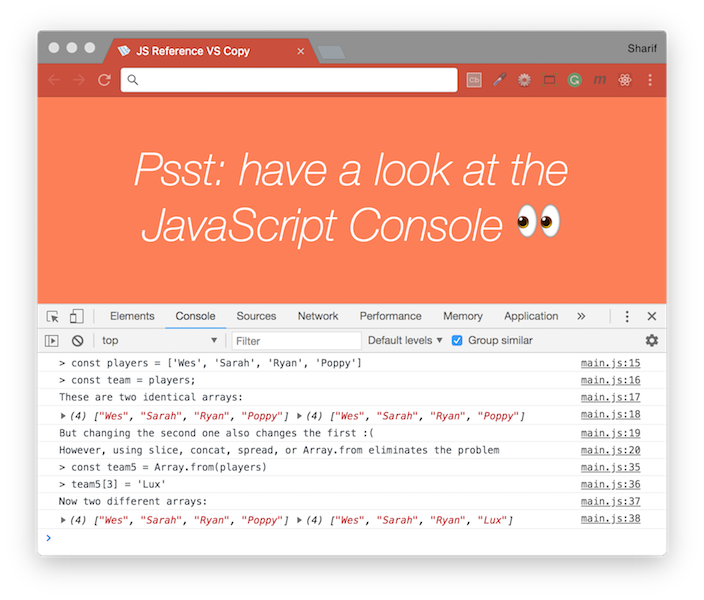

# [JavaScript 30 Day Challenge](https://javascript30.com/)

### Day 14 - Object and Arrays - Reference VS Copy
Understand the difference between references and copies in JavaScript.

#### Manipulating by Value
Primitive types are _manipulated by value_. The following types are considered primitive types in JavaScript:
- String
- Number
- Boolean
- Null
- Undefined

This means that if we define a variable as a _primitive type_, and then define _another variable_ as the previously defined variable, the second variable will _copy the current value of the first variable_. Any changes to the first variable will not effect the second, and vice versa.

Javascript will make copies of these primitive types, so changing the values like below is okay
```js
// Example 1
let age = 100;
let age2 = age;

age = 200;
// the `age2` variable will keep its original value of `100`

// Example 2
let me = "Homer"
let me2 = me
console.log(me === me2)
// true

me2 = "Marge"
console.log(me === me2, me, me2)
// false, "Homer", "Marge"; I'm not Marge

me = "Not Homer"
console.log(me === me2, me, me2)
// false, "Not Homer", "Marge"
```


#### Manipulating by Reference
Object types are _manipulated by reference_. If it's not a primitive type, it's always an object. A small list of object types in JavaScript:
- Object
- Function
- Array
- Set

##### Array
When dealing with arrays, you need to be aware of the concept of references.
```js
const players = ['Wes', 'Sarah', 'Ryan', 'Poppy'];
const team = players;

// modifying the `team` array's values will impact on the players array, for example
team[3] = 'Lux';

console.log(players[3]);
// 'Lux'

// to leave the original array intact, you must make copies it
// there are multiple methods of doing this, some are shown below
const team2 = players.slice();
const team3 = [].concat(players);
const team4 = [...players];
const team5 = Array.from(players);
```


##### Objects
Let's say we declare a variable and define it as an object, then declare _another_ variable and define it as the first variable:
```js
const me = { name: "Homer", age: 26 }
const me2 = me
console.log(me === me2)
// true

// if we update the property of the object by calling on either variable,
// both variables will reflect that change

me.name = "Not Homer"
console.log(me === me2)
// true
console.log(me2)
// { name: 'Not Homer', age: 26 }
```
This is because `me2` does not copy `me`; it contains a _reference_ to the object defined in `const me`. Any changes applied directly to the object will have an effect on all variables referencing that particular object.


So `Object.assign()` method used to make a copy of the original object. The `Object.assign()` method takes in a:
- `target` - In this case, this is a blank object `{}`
- `sources` - Object(s) to add
```js
const me3 = Object.assign({}, me)
// create a new object
console.log(me3)
// {name: 'Not Homer', age: 26}
console.log(me === me3)
// false! It's a new object instance!
console.log(me.name === me3.name)
// true! The property values are the same!
me3.name = "Marge"
console.log(`${ me.name }, ${ me3.name }`)
// 'Not Homer, Marge'
```
We have effectively copied the first object and can modify our copy without manipulating the original.


If we copy an object _containing objects_, we are only copying the first level. Anything deeper than that will still be a reference.


#### Further Reading
- [Explaining Value vs. Reference in Javascript](https://codeburst.io/explaining-value-vs-reference-in-javascript-647a975e12a0) - Some data types are copied by value and others by reference.
- [JavaScript: The Definitive Guide - By Value Versus by Reference](http://docstore.mik.ua/orelly/webprog/jscript/ch11_02.htm) - JavaScript variable referencing vs copying.

[Return to top](#javascript-30-day-challenge)

[Return to 30 Day Challenge](../../README.md)
