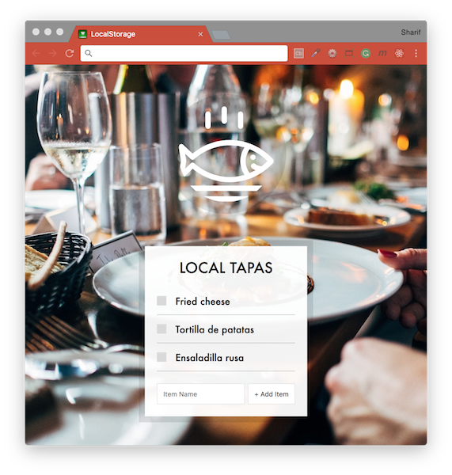

# [JavaScript 30 Day Challenge](https://javascript30.com/)


### Day 15 - LocalStorage and Event Delegation
Use local storage to persist a list.

The web page simulates a restaurant's menu. The user is able to add new dishes to the list using the `form` HTML element without having to refresh the page. We have 3 `const` variables: one referencing the _`form` element_ (`addItems`), one referencing the _`unordered list` element_ (`itemsList`), and an empty array (`items`).

#### preventDefault
This is useful if you want to stop a form submitting, which by default, will refresh the page (or direct you to a specified page).
```js
const addItem = (event) => {
    event.preventDefault()
  }
```

#### template literal ternary operator
A really cool feature implemented in this project, was the use of a ternary operator to dictate whether or not an attribute was given to some HTML.
```js
<input type="checkbox" data-index=${index} id="item${index}" ${plate.done ? 'checked' : ''} />
```
Here, the ternary operator would either add `checked` or nothing, dictated by the boolean value returned from `plate.done`.

#### event.target
When attaching event listeners to elements, you may want to access data from them. In the case of form elements, with `inputs` and `labels` etc, you might not be able to distinguish which was clicked.

Using event.target, you can narrow down to which element is needed.
```js
if (!event.target.matches('input')) return; // skip
```
This example, will return elements clicked apart from `input's`'

#### event delegation
When you wish to attach an event listener to an element that doesn't exist on the page at the time of loading, event delegation is needed.

It works by attaching the event listener to a parent element (that does exist), which then passes on the instruction (delegates) to the child element being targetted.
```js
itemsList.addEventListener('click', toggleDone);

function toggleDone(event) {
  if (!event.target.matches('input')) return; // skip
  const element = event.target;
  const index = element.dataset.index;
  items[index].done = !items[index].done;
  localStorage.setItem('items', JSON.stringify(items));

  populateList(items, itemsList);
}
```
`itemsList` is the parent element, that delegates the instruction to the `event.target` elements.

NOTE: Submit some values into the form. In your browser's dev tools, navigate to the `Application` tab and open up 'Local Storage > file://'. You should see these items stored under the key 'dishes' as a string representation of the `items` array.

#### localStorage
Browsers, now have the ability to store local data for individual webpages and browsers. The data is stored as a string that can be parsed into javascript objects.

You can set and get items from `localStorage`.
```js
localStorage.setItem('items', JSON.stringify(items));
```
Using `JSON.stringify()` here is necessary to convert it to a string representation of the object's key value pairs.

An example of utilising the data and adding it to a variable for use between browser reloads, is shown below. This enables your pages to have continuity based on existing user behaviour.
```js
const items = JSON.parse(localStorage.getItem('items'));
```
Here, the `'items'` refer to the string interpretation of the object, whilst `JSON.parse` converts the string back to a javascript object, ready for use.

#### Further Reading
- [Event.preventDefault( )](https://developer.mozilla.org/en-US/docs/Web/API/Event/preventDefault) - Event does not get explicitly handled, its default action should not be taken as it normally would be.
- [window.localStorage](https://developer.mozilla.org/en-US/docs/Web/API/Window/localStorage) - Read-only localStorage property allows you to access a storage object for the Document's origin.
- [Event delegation](https://javascript.info/event-delegation) - A single handler assign to handle multiple elements instead of assigning a handler to each of them.
- [Event.target](https://developer.mozilla.org/en-US/docs/Web/API/Event/target) - Used in order to implement event delegation.
- [Conditional (ternary) Operator](https://developer.mozilla.org/en-US/docs/Web/JavaScript/Reference/Operators/Conditional_Operator) - Used as a shortcut for the if statement.

[Return to top](#javascript-30-day-challenge)

[Return to 30 Day Challenge](../../README.md)
