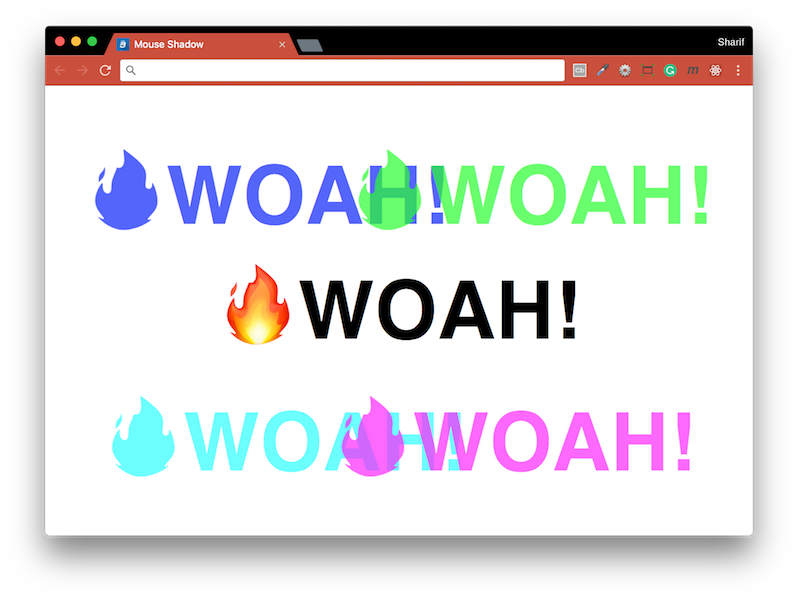

# [JavaScript 30 Day Challenge](https://javascript30.com/)


### Day 16 - CSS Text Shadow Mouse Move Effect
Change the orientation of a shadow depending on the movement of the mouse.

An HTML document with a `div` element containing an `h1` element. The `h1` element has a `textShadow` _style property_ which we want to manipulate depending on the user's current mouse location.

#### destructuring objects
This is a neat way of assigning multiple variables to a single objects properties.
```js
const { offsetWidth: width, offsetHeight: height } = hero;
```
The constants assigned here are
- `width` - hero.offsetWidth
- `height` hero.offsetHeight

Variables defined as the distance of the mouse from the event's _target element_ on the x & y axis.
```js
// using ES6 object deconstruction
let { offsetX: x, offsetY: y } = e;

// without ES6 object deconstruction
let x = e.offsetX, y = e.offsetY;
```

#### event offsets
When you are looking at coordinates based on an event listener, you have to factor in the target element that is triggered. In this case, the coordinates will change when a new target is hovered over. Adding the elements offsets from the targetted element can counteract this.
An example is shown below
```js
if (this !== event.target) {
  x = x + event.target.offsetLeft;
  y = y + event.target.offsetTop;
}
```
The event in this case is attached to a `div`, and the event.target can its child elements.

#### Math.round( )
Calculating the stretch distance for the element's shadow on the x & y axis
```js
const xWalk = Math.round((x / width * walk) - (walk / 2));
const yWalk = Math.round((y / height * walk) - (walk / 2));
```

#### Further Reading
- [Destructuring assignment](https://developer.mozilla.org/en-US/docs/Web/JavaScript/Reference/Operators/Destructuring_assignment#Object_destructuring) - Unpack values from arrays, or properties from objects, into distinct variables.
- [MouseEvent](https://developer.mozilla.org/en-US/docs/Web/API/MouseEvent) - Events that occur due to the user interacting with a mouse.
- [Math.round( )](https://developer.mozilla.org/en-US/docs/Web/JavaScript/Reference/Global_Objects/Math/round) - Returns the value of a number rounded to the nearest integer.

[Return to top](#javascript-30-day-challenge)

[Return to 30 Day Challenge](../../README.md)
