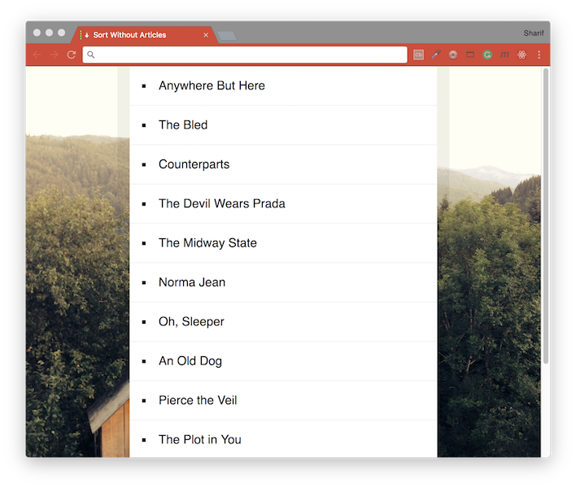

# [JavaScript 30 Day Challenge](https://javascript30.com/)


### Day 17 - Sorting Band Names without articles
Sort an array alphabetically and ignore any articles.

HTML page with an _unordered list_, and an _array of string values_ in the `script` tag. Function created to sort the values in the array (excluding the prefixes 'The', 'A', or 'An') and place the values into the _unordered list_ as _list items_.

#### replace and trim
Replacing words via regex is done via the `replace` method.
```js
bandName.replace(/^[a |the |an ]/, '').trim()
```
In this case, we are targetting `a`, `the` or `an`. The spaces are used to prevent all words beginning with these words being replaced. Trim removes whitespace from the end of the string.
- `^` Targets the start of the string
- `|` Or operator

#### ES6 implicit returns
If a function's sole task is to return something, it's best to use implicit returns, which doesn't need the use of the keyword `return`.
```js
// orignally implemented
function (a, b) {
  if(strip(a) > strip(b)) {
    return 1;
  } else {
    return -1;
  }
}
// using ternary operator
function (a, b) {
return strip(a) > strip(b) ? 1 : -1;
}
// arrow function using implicit return
(a, b) => strip(a) > strip(b) ? 1 : -1
```
This example will used a `ternary operator` to return either 1 or -1.

#### map and join
Select the `#bands` unordered list and update the _inner HTML_ to be the items in the sortedBands array stored within _list items_.
```js
document.querySelector('#bands').innerHTML = 
  sortedBands
    .map(band => `<li>${band}</li>`)
    .join('')
```

#### Further Reading
- [String.prototype.replace( )](https://developer.mozilla.org/en-US/docs/Web/JavaScript/Reference/Global_Objects/String/replace) - Returns a new string with some or all matches of a pattern replaced by a replacement.
- [String.prototype.trim( )](https://developer.mozilla.org/en-US/docs/Web/JavaScript/Reference/Global_Objects/String/trim) - Removes whitespace from both ends of a string.
- [RegExp.prototype.replace( )](https://developer.mozilla.org/en-US/docs/Web/JavaScript/Reference/Global_Objects/RegExp/@@replace) - Replaces some or all matches of a this pattern in a string by a replacement.
- [Array.prototype.map( )](https://developer.mozilla.org/en-US/docs/Web/JavaScript/Reference/Global_Objects/Array/map) - Creates a new array with the results of calling a provided function on every element in the calling array.
- [Array.prototype.join( )](https://developer.mozilla.org/en-US/docs/Web/JavaScript/Reference/Global_Objects/Array/join) - Joins all elements of an array (or an array-like object) into a string and returns this string.
- [Guide to Arrow Functions](https://medium.com/@josephcardillo/a-beginners-guide-to-arrow-functions-in-es6-part-1-187c45c6987c) - A beginner’s guide to Arrow Functions in ES6.

[Return to top](#javascript-30-day-challenge)

[Return to 30 Day Challenge](../../README.md)
