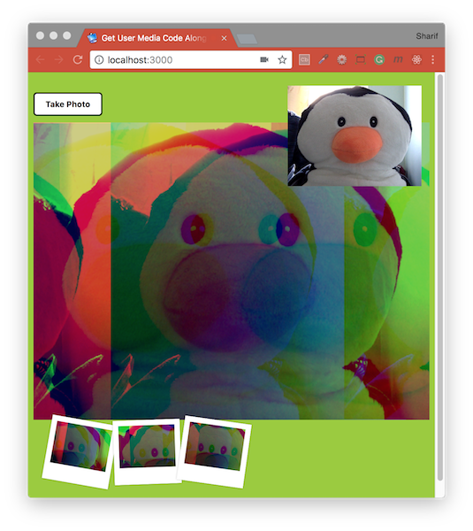

# [JavaScript 30 Day Challenge](https://javascript30.com/)


### Day 19 - Unreal Webcam Fun
Capture the feed from a webcam and manipulate it in different ways.

HTML page with a button labeled 'Take Photo' which calls upon a `takePhoto()` function on a `click` event, a collection of `input` elements of type `range` with RGB min/max labels, a `canvas` element, a `video` element, and an empty div with the class `strip`. The JavaScript code will ask permission for the user's webcam, display the feed from that webcam on the page, allow the user to save pictures that are displayed, and allow the user to alter the image using the RGB sliders.

This challenge requires the use of the `Navigator` _Web API_, the `CanvasRenderingContext2D` _Web API_, and the `MediaDevices` _Web API_, here's a simple overview:
- The `Navigator` interface is a representation of the application in which the JavaScript code is running (in most cases, the browser)
- The `MediaDevices` interface provides a way to access the user's connected media hardware, such as a webcam or microphone by using the `getUserMedia` method. The method takes an object as an argument which specifies the media items the program needs access to; in our case, the webcam.

#### Installation
To run this project you will need to download it onto your local machine and install Browsersync dependency.
Navigate inside the `day_19` folder and enter the following command on your terminal window:
```bash
# install dependency
npm install
# run the app
npm start
```
`npm start` will open [http://localhost:3000](http://localhost:3000) to view app in the browser. If you make any changes and save the changes process will automatically refresh and you will be able to see the results in the browser. To end the process hold `control` and press `c` in mac, otherwise hold `ctrl` and press `c`.
```bash
Terminal:webcam_fun$ npm start

> unreal_webcam_fun@1.0.0 start
> browser-sync start --server --files "*.css, *.html, *.js"

[Browsersync] Access URLs:
 ----------------------------
 Local: http://localhost:3000
 ----------------------------
    UI: http://localhost:3001
 ----------------------------
[Browsersync] Serving files from: ./
[Browsersync] Watching files...
[Browsersync] Reloading Browsers...
^C
Terminal:webcam_fun$
```

#### mediaDevices
The source of your video is in the form of a URL, that can be generated by the `navigator` object. This is done by its property `mediaDevices` which in turn calls a property `getUserMedia`.

The result of this is a `promise` that when successful, is used to generate the URL.
```js
video.src = window.URL.createObjectURL(localMediaStream);
```

#### RGBA color space
Browsers interpret images as a series of pixels `rgba` values that are stored in a large array of millions of values.

In this array, every pixel has four entries, one for each `rgba`. So for example
- [0, 1, 2, 3] Would mean a red value of 0, green value of 1 etc...

In this case, the pixels are drawn onto the canvas via `drawImage` which takes in the
- video stream
- starting x coordinate
- starting y coordinate
- width
- height

#### insertBefore
This method provides the same functionality as `prepend` from jQuery.
```js
strip.insertBefore(link, strip.firstChild);
```
Here, `strip` represents a div element.

#### Further Reading
- [Browsersync](https://browsersync.io/) - Keep multiple browsers & devices in sync when building websites.
- [RGBA color space](https://en.wikipedia.org/wiki/RGBA_color_space) - Combination of an RGB color model with an extra 4th alpha channel.
- [insertBefore( )](http://api.jquery.com/insertbefore/) - Insert every element in the set of matched elements before the target.
- [Navigator Web API](https://developer.mozilla.org/en-US/docs/Web/API/Navigator) - Represents the state and the identity of the user agent.
- [MediaDevices Web API](https://developer.mozilla.org/en-US/docs/Web/API/Navigator/mediaDevices) - Provides access to connected media input devices.
- [CanvasRenderingContext2D Web API](https://developer.mozilla.org/en-US/docs/Web/API/CanvasRenderingContext2D) - Used for drawing rectangles, text, images and other objects onto the canvas element.
- [URL.createObjectURL has been deprecated](https://www.fxsitecompat.com/en-CA/docs/2017/url-createobjecturl-stream-has-been-deprecated/) - Browser support for the `URL.createObjectURL` static method.

[Return to top](#javascript-30-day-challenge)

[Return to 30 Day Challenge](../../README.md)
