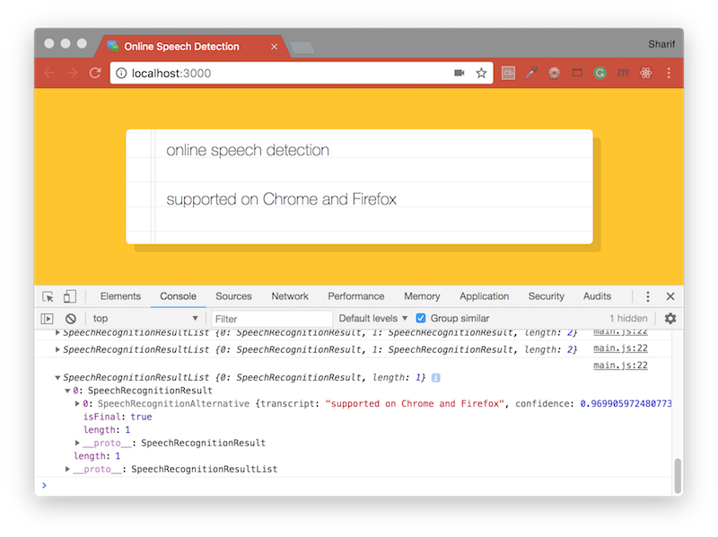

# [JavaScript 30 Day Challenge](https://javascript30.com/)


### Day 20 - Native Speech Recognition
Recognize speech and display the text in a page.

The Web Speech API enables you to incorporate voice data into web apps. The Web Speech API has two parts: SpeechSynthesis (Text-to-Speech), and SpeechRecognition (Asynchronous Speech Recognition.)

Currently the WebSpeech API is only available in Firefox and Chrome. Its speech synthesis interface lives on the browser’s window object as speechSynthesis while its speech recognition interface lives on the browser’s window object as SpeechRecognition in Firefox and as webkitSpeechRecognition in Chrome.

#### Installation
To run this project you will need to download it onto your local machine and install Browsersync dependency.
Navigate inside the `day_20` folder and enter the following command on your terminal window:
```bash
# install dependency
npm install
# run the app
npm start
```
`npm start` will open [http://localhost:3000](http://localhost:3000) to view app in the browser. Make sure you are **online** when running this app. If you make any changes and save the changes process will automatically refresh and you will be able to see the results in the browser. To end the process hold `control` and press `c` in mac, otherwise hold `ctrl` and press `c`.

#### Accessing SpeechRecognition( )
This is a window object that enables you to utilise your microphone for speech recognition functionality.
```js
window.SpeechRecognition = window.SpeechRecognition || window.webkitSpeechRecognition;
```
In chrome, you need to prepend SpeechRecognition with `webkit`.

- The browser’s speechRecognition object has start and stop methods you can use to start and stop listening for audio input.
- The speechRecoginition object can react to for onend and onresult events.
- To get a string/text of what the computer heard, you can pass the onresult event to a function and then reference the event.results[0][0].transcript property.

Next up we will create a new instance of speech recognition. We will also set the interimResults to true. This allows us to view the text as we are speaking (as opposed to waiting until we are finished speaking to print the text).
```js
const recognition = new SpeechRecognition()  
recognition.interimResults = true
```

#### Printing the Text in the Browser
Once the browser has a stream of input coming in we need to print it out to the screen. To do this we will create a paragraph. For each `pause` in speech we want to create a new paragraph element. We will only ever be editing the final <p> element. To do this we need to:
```js
let p= = document.createElement('p')  
const words = document.querySelector('.words')  
words.appendChild(p)
```

#### addEventListener end & result
The resulting event returns a SpeechRecognitionEvent which contains a results object. This is the event that can be listened for when the microphone receives input.
```js
recognition.addEventListener('end', recognition.start);
```
The result of this, is a `SpeechRecognitionResultList` object which has many properties, one of which is the `transcript` holding the recognized speech in text. We save the recognized text in a variable called speechToText and put it in the paragraph element on the page.

We need to add an event listener and convert the results into an Array:
```js
recognition.addEventListener('result', e => {  
  const transcript = Array.from(e.result)
    .map(result => result[0])
    .map(result => result.transcript)
    .join('')
})
```
Another propery from this object, that was used here is `isFinal`, which returns true or false depending on if the user is done speaking.

#### Further Reading
- [SpeechRecognition](https://developer.mozilla.org/en-US/docs/Web/API/SpeechRecognition) - An interface of the Web Speech API is the controller interface for the recognition service.
- [Build a speech recognition app](https://medium.freecodecamp.org/how-to-build-a-simple-speech-recognition-app-a65860da6108) - Integrate native speech recognition and speech synthesis in the browser using the JavaScript WebSpeech API.

[Return to top](#javascript-30-day-challenge)

[Return to 30 Day Challenge](../../README.md)
