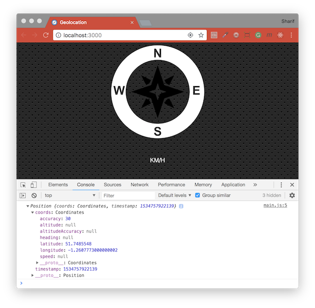

# [JavaScript 30 Day Challenge](https://javascript30.com/)


### Day 21 - Geolocation based Speedometer and Compass
Get the speed and direction of a user and display them with a compass.

Web app will need to ask the users permission to access users location data, which will then display their exact location. App will run via a local server browser-sync (rather than opening the HTML file up in the browser), and using the Geolocation API to create a compass that will guides us towards North and show us how fast we are travelling.

#### Installation
To run this project you will need to download it onto your local machine and install Browsersync dependency. Navigate inside the `day_21` folder and enter the following command on your terminal window:
```bash
# install dependency
npm install
# run the app
npm start
```
`npm start` will open [http://localhost:3000](http://localhost:3000) to view app in the browser. Make sure you are **online** when running this app. If you make any changes and save the changes process will automatically refresh and you will be able to see the results in the browser. To end the process hold `control` and press `c` in mac, otherwise hold `ctrl` and press `c`.

#### navigator.geolocation
This is a property of the window object, that contains data about the users location. You must enable access for it to work.
```js
navigator.geolocation.watchPosition(data => {
  console.log(data);
  speed.textContent = data.coords.speed;
  arrow.style.transform = `rotate(${data.coords.heading}deg)`;
  }, (error) => {
    console.error(error);
    alert('ENABLE GEOLOCATION!!!');
});
```
The geolocation object is only briefly introduced.

#### Hooking up the Compass
Add some event listeners in so that we can select the arrow in the compass & the 'km/h' speed. Both of these need to update based on the users location and speed:
```js
const arrow = document.querySelector('arrow')
const speed = document.querySelector('speed-value')
```

#### Geolocation.watchPosition( )
We will use geolocation. There are two methods that we could access `Geolocation.getCurrentPosition( )` or `Geolocation.watchPosition( )`. We are going to use `watchPosition( )` because we want multiple updates (not just the one location).
This method, allows you to update the users position at regular intervals, instead of getting a snapshot of where they are. The data returned then needs to be manipulated via a `promise`, that handles success and failure outcomes.

#### coords (coordinates)
Most of the data that you will need is contained in this object. Examples of this include the latitude, longitude and heading (representing degrees from north).

Returned data about the users current location:
```bash
Position {  
  coords: {
    accuracy: 5
    altitude: null
    altitudeAccuracy: null
    heading: 320.62
    latitude: 37.40432366
    longitude: -122.18655336
    speed: 33.89
  }, 
  timestamp: 1504759013739
}
```

#### Further Reading
- [Navigator.geolocation](https://developer.mozilla.org/en-US/docs/Web/API/Navigator/geolocation) - Returns a Geolocation object that gives Web content access to the location of the device.
- [Geolocation.getCurrentPosition( )](https://developer.mozilla.org/en-US/docs/Web/API/Geolocation/getCurrentPosition) - Get the current position of the device.
- [Geolocation.watchPosition( )](https://developer.mozilla.org/en-US/docs/Web/API/Geolocation/watchPosition) - Register a handler function that will be called automatically each time the position of the device changes.
- [Xcode - Apple Developer](https://developer.apple.com/xcode/) - Xcode 10 includes everything you need to create amazing apps for all Apple platforms.

[Return to top](#javascript-30-day-challenge)

[Return to 30 Day Challenge](../../README.md)
