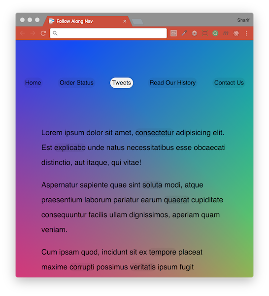
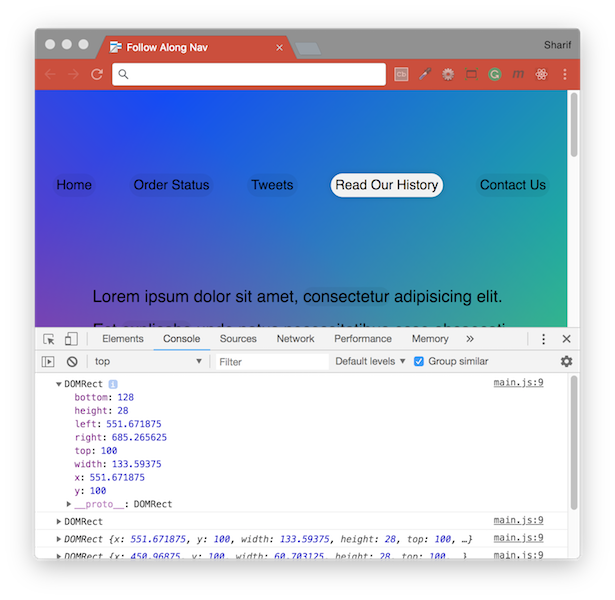

# [JavaScript 30 Day Challenge](https://javascript30.com/)


### Day 22 - Follow Along Link Highlighting
Highlight links when hovered upon dynamically.

The aim of this challenge is to create a white background `pill` that will follow the cursor around the page to highlight the current (or latest) link that the cursor rolled over.

#### Access all links
Access all of the links on the page and listen for when the cursor hovers over them.
```js
const triggers = document.querySelectorAll('a')  
const highlight = document.createElement('span')  
highlight.classList.add('highlight')  
document.body.append(highlight)

// console.log message sent every time the mouse hovers over a link
function highlightLink(event) {  
  console.log('Highlight', event)
}

triggers.forEach(a => a.addEventListener('mouseenter', highlightLink))
```


#### getBoundingClientRect( )
Adding height and width required for the highlight to match the link(entire link to be highlighted). To do this use `getBoundingClientRect()` which will give all the information about the link, where it lives on the page and how much room it takes up.

This gives us an object that looks like this:
```css
ClientRect {  
  top: 100,
  right: 396.78125,
  bottom: 128,
  left: 344.09375,
  width: 52.6875
}
```
Using this information, able to transform the highlight div to match the link location:
```js
function highlightLink(event) {  
  const linkCoordinates = this.getBoundingClientRect()
  highlight.style.width = `${linkCoordinates.width}px`
  highlight.style.height = `${linkCoordinates.height}px`
  highlight.style.transform = `translate(${linkCoordinates.left}px, ${linkCoordinates.top}px)`
}
```

#### scrollX and scrollY
The final task to ensure highlight works when the page is scrolled by calculating and adding window.scrollY. When the scrolling position changes, the values returned above will adjust to be bound to the current `top-left` of the viewport. So, to make sure the values are bound to the `top-left` of the document, you need to add `scrollX` and `scrollY`, shown below.
```js
top: linkCoords.top + window.scrollY,
left: linkCoords.left + window.scrollX,
```

#### Further Reading
- [Element.getBoundingClientRect( )](https://developer.mozilla.org/en-US/docs/Web/API/Element/getBoundingClientRect) - Returns the size of an element and its position relative to the viewport.
- [Window.scrollY](https://developer.mozilla.org/en-US/docs/Web/API/Window/scrollY) - Returns the number of pixels that the document is currently scrolled vertically.
- [Window.scrollX](https://developer.mozilla.org/en-US/docs/Web/API/Window/scrollX) - Returns the number of pixels that the document is currently scrolled horizontally.

[Return to top](#javascript-30-day-challenge)

[Return to 30 Day Challenge](../../README.md)
