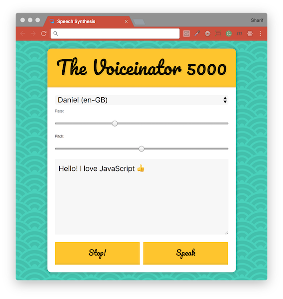

# [JavaScript 30 Day Challenge](https://javascript30.com/)


### Day 23 - Speech Synthesis
Synthesize speech and utter text written by the user.

The speech synthesis API is available in most modern browsers, which allows text to voice functionality. This project consist of:
- A select component that allows us to select the voice we want
- 2 sliders to control the rate and pitch of the voice
- A text area input that contains the text to be read
- 2 buttons to start and stop the speech synthesis

#### speechSynthesisUtterance
An interface for the Web Speech API. This contains the content the speech service will read along with options such as language and pitch.
```js
const msg = new SpeechSynthesisUtterance();
// Example properties used
msg.lang;
msg.pitch;
msg.rate;
msg.text;
```
Our rate, pitch and text must be named these exact terms as they will match up with those properties on the utterance.
- `voiceschanged` - This event listener can be used to attach an event to add voices to use.
- `getVoices()` - Will extract the voices on the device being used as an array

#### SpeechSynthesis
This is the controller interface for the speech service, which can be used to get information about the voices available. It can also be used to start and pause the speech.
```js
speechSynthesis.paused;
speechSynthesis.pending;
speechSynthesis.speaking;

speechSynthesis.cancel();
speechSynthesis.pause();
speechSynthesis.speak();
```
Above, are example properties and methods that can be used to alter the state of the speech device.

#### Anonymous function
At times you might want to provide a parameter to a function for use in an event listener. Unfortunately, doing this by a traditional function call will result in it being run on page load. Using an anonymous function, you can avoid this problem
```js
stopButton.addEventListener('click', () => toggle(false));
```
One caveat to this is the creation of a new function, doing this too much can unnecessary overhead to the code affecting its speed and efficiency.

#### Further Reading
- [Blog Treehouse - Speech Synthesis API](http://blog.teamtreehouse.com/getting-started-speech-synthesis-api) - Getting Started with the Speech Synthesis API.
- [SpeechSynthesis](https://developer.mozilla.org/en-US/docs/Web/API/SpeechSynthesis) - Interface of the Web Speech API is the controller interface for the speech service.
- [SpeechSynthesisUtterance.rate](https://developer.mozilla.org/en-US/docs/Web/API/SpeechSynthesisUtterance/rate) - Interface gets and sets the `speed` at which the utterance will be spoken at.
- [SpeechSynthesisUtterance.pitch](https://developer.mozilla.org/en-US/docs/Web/API/SpeechSynthesisUtterance/pitch) - Interface gets and sets the `pitch` at which the utterance will be spoken at.
- [SpeechSynthesisUtterance.text](https://developer.mozilla.org/en-US/docs/Web/API/SpeechSynthesisUtterance/text) - Interface gets and sets the `text` at which the utterance will be spoken at.

[Return to top](#javascript-30-day-challenge)

[Return to 30 Day Challenge](../../README.md)
