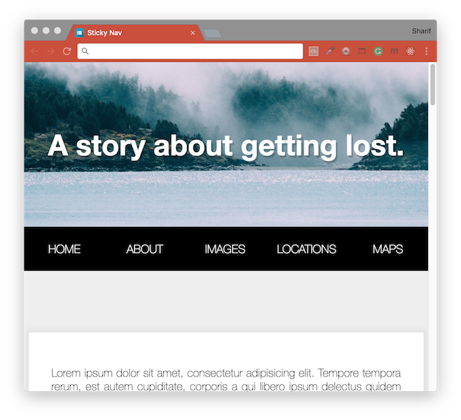
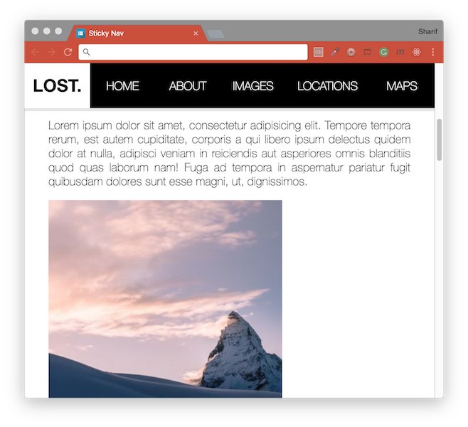

# [JavaScript 30 Day Challenge](https://javascript30.com/)


### Day 24 - Sticky Nav
Fix the nav bar once users have scrolled past its initial location.

Creating a nav bar that is placed staticly below a header image. Then as the user scrolls down and the navbar hits the top of the screen it should transition to a fixed location at the top of the browser.



#### position: fixed
Tha main purpose of this project was to learn about the effects of changing an elements position to `fixed`.

When applying this property, the element is essentially taken out of the `DOM` vacating it's space. This causes a reshuffle for the other elements, which can cause a judder.
```css
.fixed-nav nav {
  position: fixed;
  box-shadow: 0 5px rgba(0, 0, 0, .1);
}
```
One workaround to this, is to fill in the space vacated, through `padding`. This can be done multiple ways, but it makes sense to make this value programmatic, so that it adapts to further page modifications.
```js
document.body.style.paddingTop = `${nav.offsetHeight}px`;
```

#### Transition the Logo in on Scroll
An additional nicety that we are adding is the logo to transition in when the navbar becomes fixed.

Currently, our logo styling is set to:
```css
li.logo {  
  max-width: 0;
  overflow: hidden;
  background: white;
  transition: all 0.5s;
  font-weight: 600;
  font-size: 30px;
}
```
Notice the max-width and overflow. We're going to alter these as we flow down the page. This will be triggered when the fixed-nav class is applied to the body:
```css
.fixed-nav li.logo {
  max-width: 500px;
}
```

#### Subtle Body Scale
The final touch that we are adding to our site is a subtle increase of the site-wrap class. Again, we are using the fixed-nav class that has been placed on the body to action this change:
```css
.site-wrap {
  ...
  transform: scale(0.98);
  transition: transform 0.5s;
}

.fixed-nav .site-wrap {
  transform: scale(1);
}
```

#### Further Reading
- [position](https://developer.mozilla.org/en-US/docs/Web/CSS/position) - CSS property specifies how an element is positioned in a document.
- [Occupy Space](https://www.impressivewebs.com/css-things-that-dont-occupy-space/) - CSS Things That Don’t Occupy Space.

[Return to top](#javascript-30-day-challenge)

[Return to 30 Day Challenge](../../README.md)
