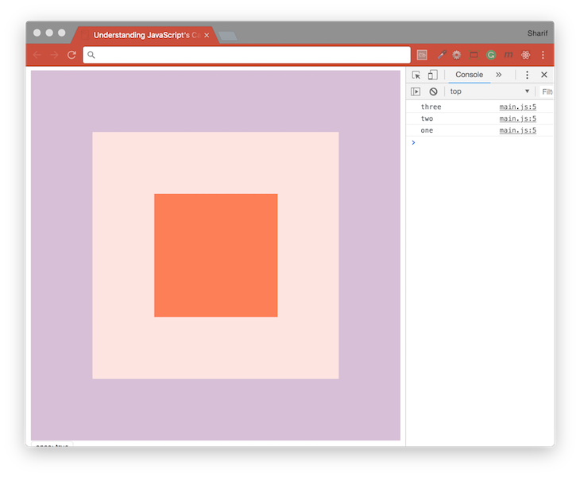

# [JavaScript 30 Day Challenge](https://javascript30.com/)


### Day 25 - Event Capture, Propagation, Bubbling and Once
Learn some rules about JavaScript's capture and bubbling.

When you click on the innermost div, we are also clicking on its parents. So the event bubbles and calls out class ‘three’ then ‘two’ then ‘one’, moving from the innermost div to the outermost.

#### capture
When an event listener has been attached to an element, that has parents with the same listener, triggering the event will lead to all elements registering. By default the events will be triggered from the inside out, but setting `capture` to true will reverse this direction to outside in.
```js
divs.forEach(div => div.addEventListener('click', logText, {
    capture: false
}));
```

#### once
This is a useful option for the `addEventListener` method, that will prevent the element from triggering multiple events. It has the same functionality as `removeEventListener`.
```js
divs.forEach(div => div.addEventListener('click', logText, {
    once: true
}));
```

#### Event Propagation
This is the blanket term that refers to `bubbling` and `capturing`. It essentially means that events will cascade up and down the document object model from the `event target` to the `window` object. The direction of propagation can be both ways.

One nice summary of the propagation is by dividing it into three phases, as follows:
- `capture phase` - From the window to the event target
- `target phase` - The event target
- `bubble phase` - From the event target back to the window

#### Further Reading
- [EventTarget.addEventListener( )](https://developer.mozilla.org/en-US/docs/Web/API/EventTarget/addEventListener) - Function that will be called whenever the specified event is delivered to the target.
- [Event.stopPropagation( )](https://developer.mozilla.org/en-US/docs/Web/API/Event/stopPropagation) - Prevents further propagation of the current event in the capturing and bubbling phases.
- [Event.preventDefault( )](https://developer.mozilla.org/en-US/docs/Web/API/Event/preventDefault) - Tells the user agent that if the event does not get explicitly handled.
- [Bubbling and capturing](https://javascript.info/bubbling-and-capturing) - Introduction into Events - Bubbling and capturing.
- [Event Bubbling and Event Capturing](https://medium.com/@vsvaibhav2016/event-bubbling-and-event-capturing-in-javascript-6ff38bec30e) - Event Bubbling and Event Capturing is the most used terminology in JavaScript at the time of event flow.
- [Event Propagation Explained](https://www.sitepoint.com/event-bubbling-javascript/) - What Is Event Bubbling in JavaScript?

[Return to top](#javascript-30-day-challenge)

[Return to 30 Day Challenge](../../README.md)
