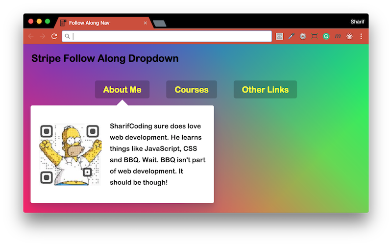

# [JavaScript 30 Day Challenge](https://javascript30.com/)


### Day 26 - Stripe Follow Along Dropdown
Get a dropdown to follow cursor through a nav bar.

#### CSS > selector
This is used when you want to match **direct** children elements.
```js
const triggers = document.querySelectorAll('.cool > li');
```
So, in this case the first `li` tag, of elements with a class of `cool` will be selected.

#### Using multiple classes for progressive effects
In this project, an element needs to be displayed and faded in. It's initially given the `display: none`, which means it can't be faded in from this state.

By utilising multiple classes and adding them sequentially, you can first add it to the page through a class with `display: block`, then add a second class with the desired transformation effect.

This is shown, in the following code.
```js
this.classList.add('trigger-enter');
setTimeout(() => this.classList.contains('trigger-enter') && this.classList.add('trigger-enter-active'), 150);
```

<b>Note:</b> a delay of 150ms has been added before adding the second class, this is for aesthetic purposes.

#### getBoundingClientRect modification
This object, will be default give values based on the current viewport's top-left point. On occasion, you might want the element you are targetting to be based on another element.

To do this, you must get that element's values via `getBoundingClientRect` and subtract these from the element you are targetting.

An example is shown below, where the `dropdown` is positioned based on the 'nav'.
```js
const navCoords = nav.getBoundingClientRect();
const dropdownCoords = dropdown.getBoundingClientRect();

const coords = {
  height: dropdownCoords.height,
  width: dropdownCoords.width,
  top: dropdownCoords.top - navCoords.top,
  left: dropdownCoords.left - navCoords.left
};
```

#### Further Reading
- [Element.getBoundingClientRect( )](https://developer.mozilla.org/en-US/docs/Web/API/Element/getBoundingClientRect) - Returns the size of an element and its position relative to the viewport.
- [Element.classList](https://developer.mozilla.org/en-US/docs/Web/API/Element/classList) - Returns a live DOMTokenList collection of the class attributes of the element.
- [CSS selectors](https://developer.mozilla.org/en-US/docs/Web/CSS/CSS_Selectors) - CSS selectors define the elements to which a set of CSS rules apply.

[Return to top](#javascript-30-day-challenge)

[Return to 30 Day Challenge](../../README.md)
