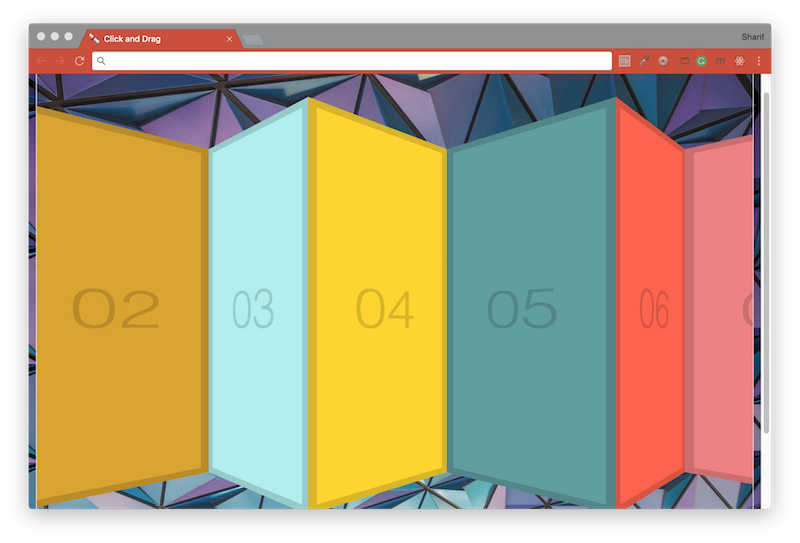

# [JavaScript 30 Day Challenge](https://javascript30.com/)


### Day 27 - Click and Drag to Scroll
Click and drag through a carousel of items.

#### Flag variable
These can be used to control the flow of a method of piece of functionality. They are mainly used to hold a value such as `true` until some condition changes and it is changed.
```js
let isDown = false;
isDown = true;
```
In this example, the isDown variable tracks the state of the mouse. When the `mousedown` event is triggered the `isDown` variable is changed, which is used to add further functionality.

#### pageX and offsetLeft
In this project, the `mousedown` event is used to initiate the click and drag functionality. For this to work effectively, an anchor point was used, representing the initial click point, the `pageX` property of the event captures this value.
```js
event.pageX
```
If a margin or padding is added, then the `pageX` value will be off, to compensate for this, you can subtract this from the parent element's offset to the window. The code to do this, is shown below
```js
startX = event.pageX - slider.offsetLeft;
```

#### Further Reading
- [MouseEvent.pageX](https://developer.mozilla.org/en-US/docs/Web/API/MouseEvent/pageX) - Returns the X (horizontal) coordinate (in pixels) at which the mouse was clicked.
- [HTMLElement.offsetLeft](https://developer.mozilla.org/en-US/docs/Web/API/HTMLElement/offsetLeft) - Returns the number of pixels that the upper left corner of the current element is offset.
- [transform: scale( )](https://developer.mozilla.org/en-US/docs/Web/CSS/transform-function/scale) - Defines a transformation that resizes an element on the 2D plane.

[Return to top](#javascript-30-day-challenge)

[Return to 30 Day Challenge](../../README.md)
