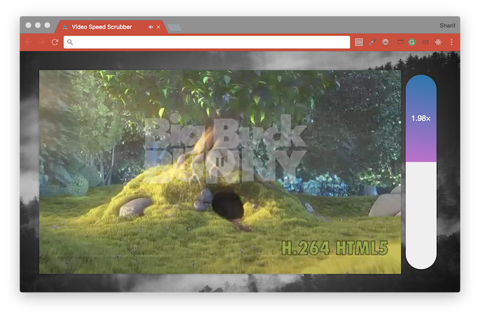

# [JavaScript 30 Day Challenge](https://javascript30.com/)


### Day 28 - Video Speed Controller UI
Control the speed of a video using a dedicated bar.

#### offsetHeight
This property represents the height of an element, including vertical padding and borders. It is measured in pixels and is returned as an integer.
```js
const percent = y / this.offsetHeight;
```
Here, this was used to in the percentage calculation used to fill the speed-bar.

#### Normalize value
It makes sense for the speed-bar to have appropriate minimum and maximum values, because of this it made sense to normalize the percentage scrolled to these values.
```js
const playBackRate = percent * (max - min) + min;
```
In this case, `minimum = 0.4` and `maximum = 4`. So, the percentage scrolled would fall between the two. For example `10%` is equal to a playBackRate of `0.43`.

#### Further Reading
- [HTMLMediaElement.playbackRate](https://developer.mozilla.org/en-US/docs/Web/API/HTMLMediaElement/playbackRate) - Sets the rate at which the media is being played back.
- [HTMLElement.offsetHeight](https://developer.mozilla.org/en-US/docs/Web/API/HTMLElement/offsetHeight) - Height of the element including vertical padding and borders, as an integer.

[Return to top](#javascript-30-day-challenge)

[Return to 30 Day Challenge](../../README.md)
