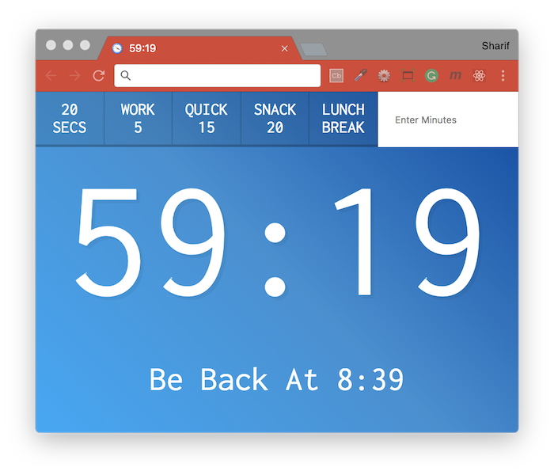

# [JavaScript 30 Day Challenge](https://javascript30.com/)


### Day 29 - Countdown Clock
Display a countdown timer and enable quick breaks.

#### setInterval( ) and clearInterval( )
The `setInterval` method has been used in previous projects, but in this particular case it's used in conjunction with `clearInterval`. When you wish for a function or code snippet to run every so often, `setInterval` can be used.
```js
countdown = setInterval(() => {
  // method
  const secondsLeft = Math.round((then - Date.now()) / 1000);
}, 1000); // time delay
```
In this case, an anonymous function which defines a constant is run every `1000 milliseconds`.

In order to clear the `countdown` variable i.e stop the method running via `setInterval` you need to clear it. If you don't do this, and try to run this method whilst it's already running (thorugh another function call), they will both run, which can cause erratic behaviour.
```js
clearInterval(countdown);
```
Here, the timed, repeated method is assigned to `countdown`, therefore clearing the variable does the job of cancelling the method calls.

#### Working with timestamps
If you want the current time, then `Date.now()` can be used, however this will return the number of milliseconds elapsed since `01/01/1970`. It's easy to turn this into a date object via `new Date(milliseconds)`, where the value extracted from `Date.now()` is used as a parameter. Using this object, various methods can be used to extract different pieces of data such as the day, month and year.
```js
const end = new Date(timestamp);
const hour = end.getHours();
const minutes = end.getMinutes();
```

#### Form element selectors
When you want to attach an event to a form, you can utilise `this` to extract it's input values.
```js
document.customForm.addEventListener('submit', function (event) {
  const mins = this.minutes.value;
});
```
Here, an event listener is attached to the form via its `name` attribute, and its inputs are extracted the same way off the form element (this).

#### Further Reading
- [JavaScript Date](https://developer.mozilla.org/en-US/docs/Web/JavaScript/Reference/Global_Objects/Date) - Creates a JavaScript Date instance that represents a single moment in time.
- [setInterval( )](https://developer.mozilla.org/en-US/docs/Web/API/WindowOrWorkerGlobalScope/setInterval) - Repeatedly calls a function or executes a code snippet, with a fixed time delay between each call.
- [clearInterval( )](https://developer.mozilla.org/en-US/docs/Web/API/WindowOrWorkerGlobalScope/clearInterval) - Cancels a timed, repeating action which was previously established by a call to setInterval( ).

[Return to top](#javascript-30-day-challenge)

[Return to 30 Day Challenge](../../README.md)
