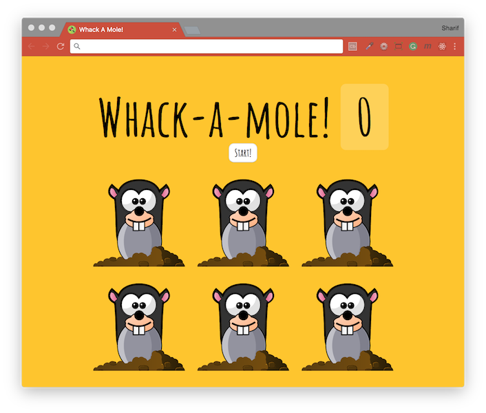

# [JavaScript 30 Day Challenge](https://javascript30.com/)


### Day 30 - Whack A Mole Game
Play the classic Whack A Mole game.

#### isTrusted
Here, the `click` event is important in determining the outcome of the game, therefore we need to protect from falsely initiating them via scripts or other modifications.

Using the `isTrusted` property allows you to ensure the event was generated by a user action.
```js
if (!event.isTrusted) return; // cheater
```
The code above, will return from the code block, if the event was not a result of user action.

#### Recursion
This technique was used to prevent the same hole from being used twice in a row. It's important to return the value in the `randomHole` method, so that it can be used recursively.
```js
let lastHole;

function randomHole(holes) {
    const idx = Math.floor(Math.random() * holes.length);
    const hole = holes[idx];

    if (lastHole === hole) {
        return randomHole(holes);
    }

    lastHole = hole;
    return hole;
}
```
Here, the `lastHole` variable will be assigned the randomly generated hole, if the following call generates the same hole, the `randomHole` will be called again until `lastHole doesn't equal hole`.

#### Further Reading
- [Event.isTrusted](https://developer.mozilla.org/en-US/docs/Web/API/Event/isTrusted) - A boolean that is true when the event was generated by a user action, and false when the event was created by a script.
- [Math.random( )](https://developer.mozilla.org/en-US/docs/Web/JavaScript/Reference/Global_Objects/Math/random) - Returns a floating-point, pseudo-random number in the range 0–1 (inclusive of 0, but not 1).

[Return to top](#javascript-30-day-challenge)

[Return to 30 Day Challenge](../../README.md)
